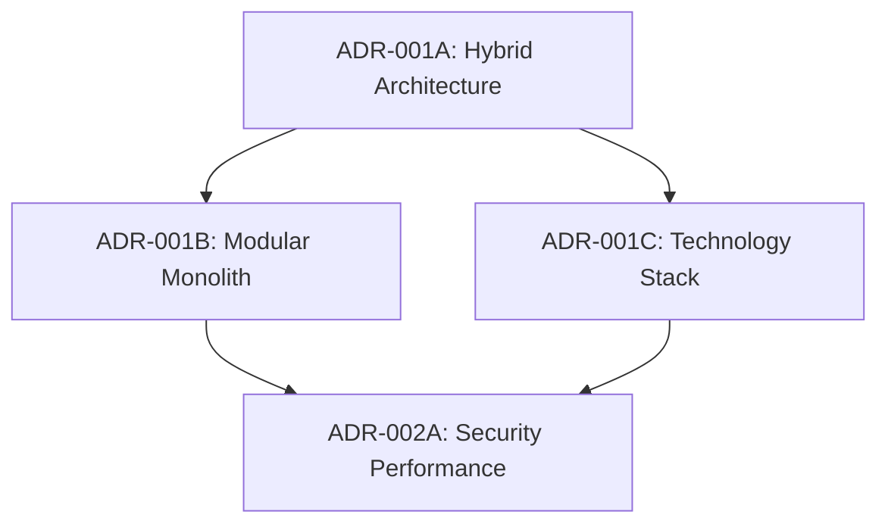
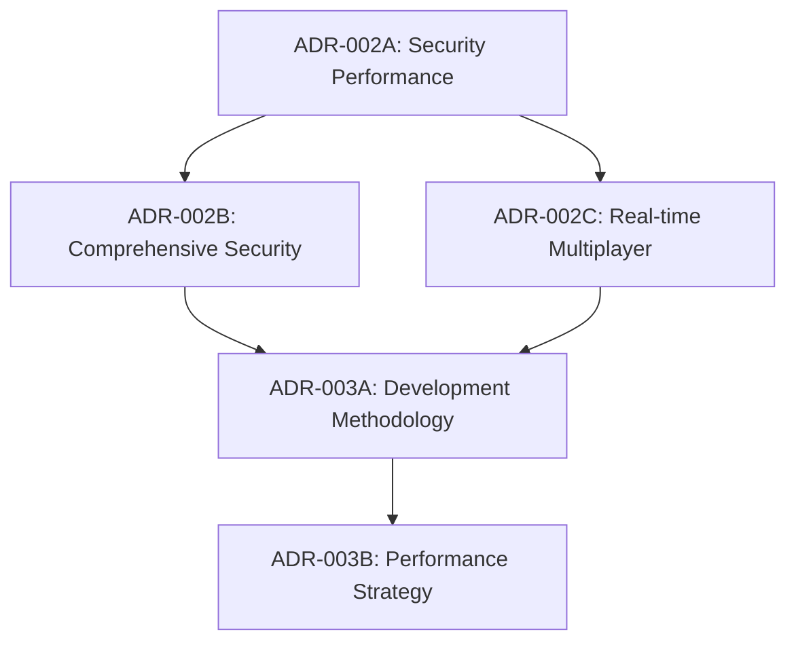
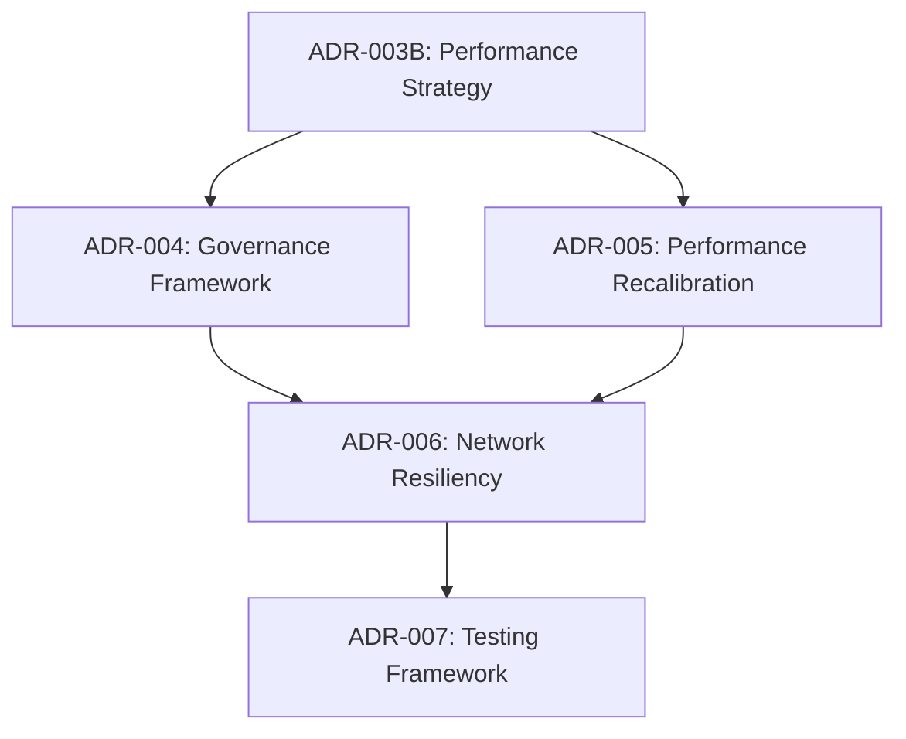

# Architectural Decision Records (ADR) Index
## Taiwan Mahjong Online Game Project

**Last Updated**: 2025-08-09  
**Total ADRs**: 13  
**Status**: Active Project Documentation

---

## ADR Overview

This index provides a comprehensive overview of all architectural decisions made for the Taiwan Mahjong online game project, organized chronologically by decision date and categorized by impact area.

---

## ADR-001 Series: Foundation Architecture

### ADR-001A: Hybrid Architecture Decision
- **File**: `ADR-001-hybrid-architecture-decision.md`
- **Status**: Accepted
- **Decision**: Modular monolith with microservices migration path
- **Impact**: High - Core architectural foundation
- **Date**: Early project phase

### ADR-001B: Modular Monolith Architecture  
- **File**: `ADR-001-modular-monolith-architecture.md`
- **Status**: Accepted
- **Decision**: DDD-based modular monolith structure
- **Impact**: High - Code organization and scalability
- **Date**: Early project phase

### ADR-001C: Technology Stack Selection
- **File**: `ADR-001-technology-stack-selection.md`
- **Status**: Accepted  
- **Decision**: React/React Native + Node.js + PostgreSQL/Redis
- **Impact**: High - Development methodology and tools
- **Date**: Early project phase

---

## ADR-002 Series: Security & Performance

### ADR-002A: Collaborative Architecture Security Performance
- **File**: `ADR-002-collaborative-architecture-security-performance.md`
- **Status**: Accepted
- **Decision**: Integrated security and performance framework
- **Impact**: High - Cross-cutting concerns
- **Date**: Mid project phase

### ADR-002B: Comprehensive Security Architecture
- **File**: `ADR-002-comprehensive-security-architecture.md`
- **Status**: Accepted
- **Decision**: ECDSA cryptographic security with 12-layer protection
- **Impact**: High - Security framework
- **Date**: Mid project phase

### ADR-002C: Real-time Multiplayer Architecture  
- **File**: `ADR-002-real-time-multiplayer-architecture.md`
- **Status**: Accepted
- **Decision**: WebSocket-based real-time communication
- **Impact**: High - Core gameplay functionality
- **Date**: Mid project phase

---

## ADR-003 Series: Development & Optimization

### ADR-003A: Development Methodology Selection
- **File**: `ADR-003-development-methodology-selection.md`
- **Status**: Accepted
- **Decision**: DDD + Clean Architecture (backend) + Component-based + Redux (frontend)
- **Impact**: High - Development approach and team organization
- **Date**: Mid project phase

### ADR-003B: Performance Optimization Strategy
- **File**: `ADR-003-performance-optimization-strategy.md`
- **Status**: Accepted
- **Decision**: Multi-layer caching with <70ms response time targets
- **Impact**: High - User experience and scalability
- **Date**: Mid project phase

---

## ADR-004 Series: Recalibration (Post-Review)

### ADR-004: Architectural Governance Framework
- **File**: `ADR-004-architectural-governance-framework.md`
- **Status**: Accepted ✅
- **Decision**: Automated fitness functions for CI/CD boundary enforcement
- **Impact**: High - Technical debt prevention and architecture integrity
- **Date**: 2025-08-08
- **Owner**: System Architect (Alex Chen)

### ADR-005: Performance Targets Recalibration
- **File**: `ADR-005-performance-targets-recalibration.md`
- **Status**: Accepted ✅
- **Decision**: Evidence-based mobile 45-50fps with Performance Budget + Low-Fidelity Mode
- **Impact**: High - User experience optimization and technical feasibility
- **Date**: 2025-08-08
- **Owners**: Frontend Architect (David Kim) + Mobile Architect (Sarah Patel)

### ADR-006: Network Resiliency Architecture
- **File**: `ADR-006-network-resiliency-architecture.md`
- **Status**: Accepted ✅
- **Decision**: Client-side command queue with heartbeat protocol and anti-abuse mechanisms
- **Impact**: High - Mobile network reliability and user experience
- **Date**: 2025-08-08
- **Owners**: Mobile Architect (Sarah Patel) + Frontend Architect (David Kim)

### ADR-007: 4-Layer Testing Framework
- **File**: `ADR-007-4-layer-testing-framework.md`
- **Status**: Accepted ✅
- **Decision**: Unit → Integration → Scenario → Expert validation for 100% Taiwan Mahjong rule accuracy
- **Impact**: Critical - Cultural authenticity and game rule integrity
- **Date**: 2025-08-08
- **Owner**: Game Systems Architect (Lisa Wang)

### ADR-009: AI Alternative - Rule-Based Expert System
- **File**: `ADR-009-ai-alternative-rule-based-expert-system.md`
- **Status**: Accepted ✅
- **Decision**: Replace AI components with deterministic Rule-Based Expert System
- **Impact**: High - Practice modes, tutorial systems, and coaching features
- **Date**: 2025-08-09
- **Owners**: Game Systems Architect (Lisa Wang) + Systems Architect (Alex Chen)

---

## Decision Impact Matrix

| Impact Area | Primary ADRs | Secondary ADRs | Current Status |
|-------------|-------------|----------------|----------------|
| **Core Architecture** | ADR-001A, ADR-001B | ADR-004 | ✅ Stable + Governance |
| **Technology Stack** | ADR-001C | ADR-003A | ✅ Validated |
| **Security Framework** | ADR-002A, ADR-002B | ADR-006 | ✅ Comprehensive |
| **Performance** | ADR-002A, ADR-003B | ADR-005 | ✅ Recalibrated |
| **Development Process** | ADR-003A | ADR-004, ADR-007 | ✅ Enhanced |
| **Mobile Experience** | ADR-002C | ADR-005, ADR-006 | ✅ Optimized |
| **Game Rule Integrity** | ADR-007 | ADR-003A, ADR-009 | ✅ Expert-validated |
| **AI/Practice Systems** | ADR-009 | ADR-007 | ✅ Rule-based Solution |

---

## Decision Timeline & Dependencies

### Phase 1: Foundation Decisions (Early Project)

### Phase 2: Implementation Decisions (Mid Project)

### Phase 3: Recalibration Decisions (Post-Review)

---

## ADR Governance Process

### Decision Authority Matrix
| Decision Type | Authority Level | Review Required | ADR Required |
|---------------|----------------|-----------------|--------------|
| **Architecture Foundation** | Architecture Review Board | 5-specialist review | ✅ Mandatory |
| **Technology Selection** | Technical Lead + Architects | Peer review | ✅ Mandatory |
| **Performance Targets** | Architecture Review Board | PoC validation | ✅ Mandatory |
| **Security Frameworks** | Security Architect + Review Board | Security audit | ✅ Mandatory |
| **Testing Strategies** | QA Lead + Game Systems Architect | Expert consultation | ✅ Mandatory |

### ADR Lifecycle
1. **Proposed**: Initial decision proposal with context and options
2. **Under Review**: Stakeholder review and feedback collection
3. **Accepted**: Formal approval and implementation authorization
4. **Implemented**: Decision implementation in progress
5. **Validated**: Implementation complete and validated
6. **Superseded**: Replaced by newer decision (with reference)

### Current ADR Status Summary
- **Accepted & Implemented**: ADR-001 series, ADR-002 series, ADR-003 series
- **Accepted & In Implementation**: ADR-004, ADR-005, ADR-006, ADR-007, ADR-009
- **Under Review**: None
- **Superseded**: None

---

## Related Documentation

### Architecture Documentation
- `docs/architecture-recalibration-2025-08-08.md` - Comprehensive recalibration report
- `docs/architecture-recalibration-validation-report.md` - Validation against original objectives
- `docs/detailed-implementation-roadmap.md` - Implementation plan with ADR integration

### Review Documentation
- `docs/from_gemini/collaborative-architecture-review-summary-report.md` - 5-specialist review outcomes
- `docs/from_gemini/architectural-governance.md` - Governance framework details
- `docs/from_gemini/client-side-network-resiliency-design.md` - Network resiliency design

### Technical Specifications
- `docs/technical-specifications-cryptographic-monitoring.md` - Updated with recalibration enhancements
- `docs/台灣麻將線上遊戲PRD.md` - PRD updated with recalibrated requirements

### Implementation Decisions
- `docs/ai-alternative-analysis.md` - AI alternative technical analysis (ADR-009)
- `docs/ai-alternatives-collaborative-meeting-2025-08-09.md` - AI decision collaborative discussion (ADR-009)

---

## ADR Maintenance

### Review Schedule
- **Monthly**: ADR effectiveness review
- **Quarterly**: Architecture alignment validation  
- **Phase Completion**: Comprehensive ADR impact assessment
- **Post-Implementation**: Lessons learned documentation

### Update Process
- All ADR updates require pull request review
- Cross-reference updates when decisions are related
- Maintain decision traceability and impact assessment
- Document lessons learned for future decisions

### Contact Information
- **ADR Maintainer**: Architecture Review Board
- **Review Coordination**: Project Management Office
- **Technical Questions**: Specialist Architects (by domain)

---

**Index Status**: ✅ Current  
**Last Review**: 2025-08-09  
**Next Review**: 2025-09-08 (Monthly)  
**Total Decisions Tracked**: 13 ADRs across 4 major series + 1 implementation decision