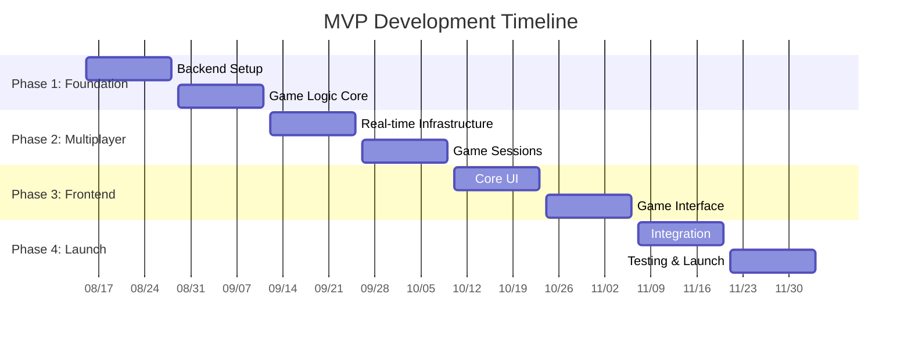

# Collaborative MVP Architecture Session
## Taiwan Mahjong Online Game - Minimum Viable Product

**Session Date**: 2025-08-08  
**Session Type**: MVP Architecture Design  
**Duration**: 3 hours  
**Status**: In Progress

---

## Session Participants

| Role | Name | ID | Primary Focus |
|------|------|----|----- ---------|
| **System Architect** | Alex Chen | `systems_architect` | Overall architecture, integration patterns |
| **Frontend Architect** | David Kim | `frontend_architect` | Web UI/UX, performance optimization |
| **Game Systems Architect** | Lisa Wang | `game_systems_architect` | Taiwan Mahjong rules, game logic |
| **Data Architect** | James Thompson | `data_architect` | Database design, caching strategy |
| **Mobile Architect** | Sarah Patel | `mobile_architect` | Mobile experience, cross-platform |
| **Security Specialist** | Marcus Rodriguez | `security_specialist` | Authentication, anti-cheat, data protection |
| **Performance Expert** | Elena Volkov | `performance_expert` | Scalability, response times, optimization |
| **Maintainability Architect** | Thomas Mueller | `maintainability_architect` | Code quality, testing, long-term sustainability |

---

## Session Agenda

### 1. MVP Vision & Objectives (30 minutes)
- Define MVP core value proposition
- Establish success criteria
- Identify critical path features

### 2. Architect Domain Presentations (80 minutes - 10 minutes each)
Each architect presents their MVP recommendations:
- Must-have features for their domain
- Architecture simplifications for MVP
- Risk mitigation strategies
- Implementation priorities

### 3. Collaborative MVP Scope Definition (60 minutes)
- Feature prioritization matrix
- Architecture decision alignment
- Resource allocation discussion
- Timeline feasibility assessment

### 4. MVP Implementation Plan (50 minutes)
- Development phases
- Critical dependencies
- Testing strategy
- Launch criteria

---

## MVP Core Principles

Before we begin individual architect presentations, let's establish our MVP guiding principles:

### **MVP Success Definition**
✅ **Authentic Taiwan Mahjong Experience**: 100% traditional 16-tile rule compliance  
✅ **Stable 4-Player Online Multiplayer**: Seamless real-time gameplay  
✅ **Cross-Platform Foundation**: Web-first with mobile-ready architecture  
✅ **Market Validation Ready**: Production-quality for early adopter testing  

### **MVP Constraints**
⏰ **Timeline**: 4 months (16 weeks) maximum  
👥 **Team Size**: 8-10 developers (smaller than full project)  
💰 **Budget**: 60% of full project budget  
🎯 **Scope**: Core gameplay only, minimal auxiliary features  

---

## Architect Presentations

### **Alex Chen (System Architect) - MVP Architecture Foundation**

**Opening Statement**: "For the MVP, we need to maintain architectural integrity while dramatically simplifying scope. The key is building the right foundation that won't require rewriting for the full product."

#### **MVP Architecture Recommendations**:

1. **Simplified Modular Monolith**
   - Focus on 3 core modules: Game, Player, Authentication
   - Defer Billing, Analytics, and Social features
   - Maintain clean boundaries for future expansion

2. **Essential Infrastructure Only**
   - Single-region deployment (US-West-2)
   - Basic monitoring (no advanced observability)
   - Standard load balancing (no multi-region)

3. **MVP Technology Stack**
   - Backend: Node.js + Express (simplified from full DDD)
   - Database: PostgreSQL primary + Redis cache
   - Frontend: React.js (defer React Native for now)
   - Real-time: Socket.io (simpler than custom WebSocket)

4. **Deferred Architectural Components**
   - Microservices migration capability (maintain structure only)
   - Advanced security (basic auth + HTTPS only)
   - Comprehensive logging (basic logging only)

#### **System Architect MVP Priorities**:
✅ **Critical**: Game state management, player authentication, real-time communication  
⚠️ **Important**: Basic monitoring, error handling, data persistence  
❌ **Deferred**: Advanced security, multi-region, comprehensive observability  

**Architecture Simplification Impact**: "We can deliver 80% of the value with 40% of the complexity by focusing on core game mechanics first."

---

### **David Kim (Frontend Architect) - MVP Web Experience**

**Opening Statement**: "The MVP frontend needs to prove our Taiwan Mahjong experience is compelling while establishing patterns for future mobile development."

#### **MVP Frontend Recommendations**:

1. **Web-Only MVP (Defer Mobile)**
   - Focus on desktop/tablet web experience
   - Responsive design foundation for mobile web
   - Prepare component architecture for React Native later

2. **Simplified 3D Experience**
   - Basic 3D mahjong table (reduce visual complexity)
   - Standard tile textures (defer premium artwork)
   - Target 60fps on modern browsers only

3. **Essential UI Components Only**
   ```typescript
   // MVP Component Library Structure
   components/
   ├── Game/
   │   ├── MahjongTable.tsx          // Basic 3D game table
   │   ├── PlayerHand.tsx            // Tile display and selection
   │   ├── GameActions.tsx           // Mopai, Dapai, Pengpai, Gangpai, Hupai
   │   └── ScoreDisplay.tsx          // Basic scoring display
   ├── Lobby/
   │   ├── RoomList.tsx              // Simple room browser
   │   ├── CreateRoom.tsx            // Basic room creation
   │   └── JoinRoom.tsx              // Room joining interface
   └── Core/
       ├── Authentication.tsx        // Login/register
       ├── PlayerProfile.tsx         // Basic profile
       └── ConnectionStatus.tsx      // Network status indicator
   ```

4. **MVP State Management**
   - Redux Toolkit (simplified state structure)
   - Basic game state synchronization
   - Minimal client-side validation

5. **Deferred Frontend Features**
   - Advanced animations and transitions
   - Comprehensive accessibility features
   - Performance optimization beyond basics
   - Mobile-specific UI patterns

#### **Frontend MVP Priorities**:
✅ **Critical**: Game board, tile interaction, real-time updates, room management  
⚠️ **Important**: Responsive design, basic animations, error states  
❌ **Deferred**: Advanced UX, mobile app, premium visuals, accessibility compliance  

**Performance Target Adjustment**: "Target 60fps on Chrome/Firefox/Safari on devices from 2020+. Acceptable degradation on older devices."

---

### **Lisa Wang (Game Systems Architect) - MVP Game Logic**

**Opening Statement**: "The MVP game logic must be 100% authentic Taiwan Mahjong. This is non-negotiable - we can simplify everything else, but not the rules."

#### **MVP Game System Recommendations**:

1. **Core Taiwan Mahjong Implementation**
   - 144-tile system with all traditional tiles
   - Complete 16-tile gameplay mechanics
   - All traditional 台數計算 patterns (20+ scoring patterns)
   - Essential edge cases: 過水, 詐胡, 搶槓

2. **Simplified Game Modes**
   ```typescript
   // MVP Game Modes
   enum GameMode {
     CASUAL = 'casual',           // ✅ MVP - Basic 4-player games
     // RANKED = 'ranked',        // ❌ Defer - Requires ELO system
     // TOURNAMENT = 'tournament', // ❌ Defer - Complex bracketing
     // AI_PRACTICE = 'ai_practice' // ❌ Defer - Requires AI development
   }
   ```

3. **Essential Game Features Only**
   - 4-player online multiplayer
   - Real-time tile playing
   - Automated scoring calculation
   - Basic game replay (command log only)

4. **MVP Game Flow**
   ```typescript
   // Simplified Game State Machine
   enum GamePhase {
     WAITING_FOR_PLAYERS,  // ✅ MVP - Room filling
     DEALING,              // ✅ MVP - Initial deal
     PLAYING,              // ✅ MVP - Main gameplay
     SCORING,              // ✅ MVP - Round end
     FINISHED              // ✅ MVP - Game complete
     // PAUSED,            // ❌ Defer - Pause/resume
     // SPECTATING         // ❌ Defer - Observer mode
   }
   ```

5. **Deferred Game Features**
   - AI opponents for practice
   - Advanced statistics and analytics
   - Game replay with visual playback
   - Spectator mode
   - Tournament systems
   - Ranking/ELO systems

#### **Game Systems MVP Priorities**:
✅ **Critical**: Complete Taiwan Mahjong rules, 4-player multiplayer, scoring system  
⚠️ **Important**: Game state persistence, basic replay, error recovery  
❌ **Deferred**: AI opponents, ranking systems, advanced statistics, tournaments  

**Rule Authenticity Guarantee**: "We will implement our 4-layer testing framework even for MVP - rule accuracy cannot be compromised."

---

### **James Thompson (Data Architect) - MVP Data Strategy**

**Opening Statement**: "MVP data architecture should be simple but not simplistic. We need clean data patterns that scale when we add features."

#### **MVP Data Architecture Recommendations**:

1. **Simplified Database Schema**
   ```sql
   -- MVP Core Tables Only
   CREATE TABLE players (
       id UUID PRIMARY KEY,
       username VARCHAR(50) UNIQUE,
       email VARCHAR(255) UNIQUE,
       password_hash VARCHAR(255),
       created_at TIMESTAMP DEFAULT NOW()
   );
   
   CREATE TABLE games (
       id UUID PRIMARY KEY,
       status VARCHAR(20),
       current_phase VARCHAR(20),
       created_at TIMESTAMP DEFAULT NOW(),
       updated_at TIMESTAMP DEFAULT NOW()
   );
   
   CREATE TABLE game_players (
       game_id UUID REFERENCES games(id),
       player_id UUID REFERENCES players(id),
       seat_position INTEGER,
       score INTEGER DEFAULT 0,
       PRIMARY KEY (game_id, player_id)
   );
   
   CREATE TABLE game_commands (
       id UUID PRIMARY KEY,
       game_id UUID REFERENCES games(id),
       player_id UUID REFERENCES players(id),
       command_type VARCHAR(20),
       command_data JSONB,
       created_at TIMESTAMP DEFAULT NOW()
   );
   ```

2. **Minimal Caching Strategy**
   - Redis for active game states only
   - Basic session storage
   - No advanced caching patterns for MVP

3. **Essential Data Patterns**
   - Event sourcing for game commands (replay capability)
   - Basic CRUD for user management
   - Simple game state serialization

4. **Deferred Data Features**
   - Complex analytics schemas
   - Data warehousing
   - Advanced caching strategies
   - Multi-region data replication
   - Comprehensive audit logging

#### **Data MVP Priorities**:
✅ **Critical**: Game state persistence, command logging, user authentication  
⚠️ **Important**: Basic caching, data backup, query optimization  
❌ **Deferred**: Analytics, data warehousing, advanced observability, multi-region  

**Data Scalability**: "MVP schema designed to handle 1,000 concurrent players. Clean migration path to full architecture."

---

### **Sarah Patel (Mobile Architect) - MVP Mobile Strategy**

**Opening Statement**: "For MVP, I recommend mobile web over native apps. This gives us mobile reach without the complexity of app stores and native development."

#### **MVP Mobile Recommendations**:

1. **Mobile Web First (Defer Native Apps)**
   - Progressive Web App (PWA) with mobile optimization
   - Responsive design for phone/tablet browsers
   - Touch-optimized controls for tile selection

2. **Mobile Web Features**
   ```typescript
   // MVP Mobile Web Optimizations
   const mobileOptimizations = {
     viewport: 'responsive design for 375px+ screens',
     touch: 'tap targets 44px minimum',
     performance: 'optimized for 4G networks',
     offline: 'basic offline capability via service worker',
     install: 'PWA installation prompts'
   };
   ```

3. **Essential Mobile UX**
   - Touch-friendly tile selection
   - Landscape orientation for optimal play
   - Basic haptic feedback (where supported)
   - Connection status indicators

4. **Deferred Mobile Features**
   - Native iOS/Android apps
   - Advanced native integrations
   - App store distribution
   - Native performance optimizations
   - Advanced offline capabilities

#### **Mobile MVP Priorities**:
✅ **Critical**: Mobile web responsiveness, touch controls, PWA installation  
⚠️ **Important**: Landscape optimization, network status, basic offline capability  
❌ **Deferred**: Native apps, app store presence, advanced mobile features  

**Mobile Strategy**: "PWA gives us 80% of native app benefits with 20% of the complexity. Perfect for MVP validation."

---

### **Marcus Rodriguez (Security Specialist) - MVP Security Framework**

**Opening Statement**: "MVP security should be 'secure by default' but not over-engineered. Focus on essential protections without complex security infrastructure."

#### **MVP Security Recommendations**:

1. **Essential Security Only**
   ```typescript
   // MVP Security Stack
   const mvpSecurity = {
     authentication: 'JWT tokens with HTTP-only cookies',
     authorization: 'Basic RBAC (player/admin)',
     transport: 'HTTPS everywhere',
     validation: 'Input sanitization and validation',
     sessions: 'Secure session management',
     passwords: 'bcrypt hashing'
   };
   ```

2. **Basic Anti-Cheat**
   - Server-side game state validation
   - Basic command rate limiting
   - Simple duplicate action detection
   - No advanced ML-based detection for MVP

3. **MVP Security Boundaries**
   - Frontend validation for UX (not security)
   - Backend validation for all game actions
   - Basic audit logging for debugging

4. **Deferred Security Features**
   - Advanced cryptographic signatures (ECDSA)
   - Comprehensive audit logging
   - ML-based cheat detection
   - Advanced threat monitoring
   - Security compliance frameworks

#### **Security MVP Priorities**:
✅ **Critical**: HTTPS, JWT auth, input validation, server-side game validation  
⚠️ **Important**: Rate limiting, basic audit logs, secure sessions  
❌ **Deferred**: Advanced crypto, ML anti-cheat, compliance frameworks, threat intelligence  

**Security Principle**: "Secure the MVP properly, but avoid security theater that doesn't add real protection."

---

### **Elena Volkov (Performance Expert) - MVP Performance Strategy**

**Opening Statement**: "MVP performance should target the 'good enough' threshold while establishing monitoring to understand real user patterns."

#### **MVP Performance Recommendations**:

1. **Realistic Performance Targets**
   ```typescript
   // MVP Performance Targets
   const mvpTargets = {
     backend: '<100ms response time (90th percentile)', // Relaxed from <70ms
     frontend: '60fps on modern browsers',
     mobile: '30fps mobile web acceptable',
     concurrent: '500 players maximum for MVP',
     network: '<5 second reconnection',
     startup: '<3 second initial load'
   };
   ```

2. **Essential Performance Optimizations**
   - Basic React memoization
   - Simple Redis caching for active games
   - Image optimization for tile assets
   - Gzip compression
   - CDN for static assets

3. **MVP Monitoring**
   - Basic application metrics (response times, errors)
   - Simple uptime monitoring
   - Browser performance API for frontend
   - No advanced observability stack

4. **Deferred Performance Features**
   - Advanced caching strategies
   - Performance budgets and monitoring
   - Comprehensive observability
   - Auto-scaling infrastructure
   - Advanced optimization techniques

#### **Performance MVP Priorities**:
✅ **Critical**: Basic caching, image optimization, simple monitoring  
⚠️ **Important**: Response time tracking, error monitoring, uptime alerts  
❌ **Deferred**: Advanced observability, auto-scaling, performance budgets, A/B testing  

**Performance Philosophy**: "Measure first, optimize second. MVP gives us real user data to guide optimization priorities."

---

### **Thomas Mueller (Maintainability Architect) - MVP Code Quality**

**Opening Statement**: "MVP code quality should enable rapid iteration while preventing technical debt that would force a rewrite."

#### **MVP Maintainability Recommendations**:

1. **Essential Code Quality**
   ```typescript
   // MVP Code Quality Standards
   const mvpQuality = {
     testing: '80% coverage for game logic, 60% overall',
     linting: 'ESLint + Prettier for consistency',
     typing: 'TypeScript strict mode',
     documentation: 'README + API docs + code comments',
     review: 'Peer review for all changes',
     ci: 'Basic CI/CD pipeline'
   };
   ```

2. **Simplified Testing Strategy**
   - Unit tests for Taiwan Mahjong rules (critical)
   - Integration tests for API endpoints
   - Basic E2E tests for happy path
   - Manual testing for edge cases

3. **MVP Development Practices**
   - Clean Architecture principles (simplified)
   - Basic error handling and logging
   - Code formatting and linting automation
   - Git workflow with feature branches

4. **Deferred Quality Practices**
   - Comprehensive test automation
   - Advanced static analysis
   - Performance testing automation
   - Complex deployment strategies

#### **Maintainability MVP Priorities**:
✅ **Critical**: TypeScript, basic testing, code review, CI/CD  
⚠️ **Important**: Documentation, error handling, logging, code formatting  
❌ **Deferred**: Advanced testing, static analysis, performance testing automation  

**Quality Balance**: "High standards for game logic, pragmatic standards for everything else. Technical debt is acceptable if isolated and documented."

---

## Collaborative MVP Scope Definition

### **Feature Prioritization Matrix**

Based on all architect inputs, here's our collaborative feature prioritization:

#### **MUST HAVE (MVP Core)**
| Feature | System | Frontend | Game | Data | Mobile | Security | Performance | Maintainability |
|---------|--------|----------|------|------|---------|----------|------------|-----------------|
| **Taiwan Mahjong 4-Player** | ✅ | ✅ | ✅ | ✅ | ✅ | ✅ | ✅ | ✅ |
| **Real-time Multiplayer** | ✅ | ✅ | ✅ | ✅ | ✅ | ⚠️ | ✅ | ✅ |
| **Web Interface** | ✅ | ✅ | ✅ | ⚠️ | ⚠️ | ✅ | ✅ | ✅ |
| **Basic Authentication** | ✅ | ✅ | ⚠️ | ✅ | ✅ | ✅ | ✅ | ✅ |
| **Room Management** | ✅ | ✅ | ✅ | ✅ | ✅ | ⚠️ | ✅ | ✅ |

#### **SHOULD HAVE (MVP Enhanced)**
| Feature | Consensus | Notes |
|---------|-----------|-------|
| **Mobile Web (PWA)** | 7/8 agree | Sarah leads, others support |
| **Basic 3D Interface** | 6/8 agree | David pushes for it, Elena concerned about performance |
| **Game Replay** | 5/8 agree | Game/Data want it, others neutral |
| **Connection Recovery** | 8/8 agree | All architects see value |

#### **COULD HAVE (Post-MVP)**
- AI opponents
- Advanced statistics
- Social features
- Native mobile apps
- Advanced security

#### **WON'T HAVE (MVP)**
- Ranking/ELO systems
- Tournament modes
- Monetization features
- Advanced analytics
- Multi-language support

### **Architecture Decision Consensus**

#### **Unanimous Decisions (8/8)**
1. **Taiwan Mahjong rule accuracy is non-negotiable**
2. **Web-first approach for MVP**
3. **Simplified but clean architecture**
4. **Basic security is sufficient for MVP**
5. **Focus on core gameplay experience**

#### **Majority Decisions (6+/8)**
1. **Include basic 3D interface** (6/8 - Performance concerns noted)
2. **PWA for mobile reach** (7/8 - Native app development deferred)
3. **Event sourcing for game commands** (6/8 - Enables replay/debugging)
4. **80% test coverage for game logic** (7/8 - Quality non-negotiable for rules)

#### **Split Decisions (Requiring Discussion)**
1. **Advanced caching strategy** (4/4 split - System/Data/Performance vs Frontend/Mobile/Security/Maintainability)
2. **Real-time protocol complexity** (5/3 split - Socket.io vs custom WebSocket)

---

## MVP Architecture Decisions

### **Final MVP Architecture Stack**
```typescript
// MVP Technology Decisions
const mvpStack = {
  backend: {
    runtime: 'Node.js 18+',
    framework: 'Express.js',
    language: 'TypeScript',
    architecture: 'Simplified modular monolith'
  },
  database: {
    primary: 'PostgreSQL 14+',
    cache: 'Redis 7+',
    orm: 'Prisma (simplified schema)'
  },
  frontend: {
    framework: 'React 18+ with TypeScript',
    state: 'Redux Toolkit',
    styling: 'Tailwind CSS',
    bundler: 'Vite'
  },
  realtime: {
    protocol: 'Socket.io',
    fallback: 'Long polling'
  },
  deployment: {
    platform: 'Docker containers',
    cloud: 'AWS (single region)',
    cdn: 'CloudFront',
    monitoring: 'Basic CloudWatch'
  }
};
```

### **MVP Security Architecture**
```typescript
const mvpSecurity = {
  authentication: 'JWT + HTTP-only cookies',
  authorization: 'Basic RBAC',
  transport: 'HTTPS (Let\'s Encrypt)',
  validation: 'Joi + express-validator',
  rateLimit: 'express-rate-limit',
  cors: 'Strict CORS policy'
};
```

### **MVP Database Schema (Simplified)**
```sql
-- Core MVP Tables (8 tables total)
- players (authentication, profile)
- games (game sessions)
- game_players (player participation)
- game_commands (event sourcing)
- rooms (lobby management)
- sessions (user sessions)
- game_states (current state snapshots)
- system_logs (basic logging)
```

---

## MVP Implementation Roadmap

### **Phase 1: Foundation (Weeks 1-4)**
**Sprint 1-2: Backend Foundation**
- [ ] Project setup with TypeScript/Node.js
- [ ] Database schema implementation
- [ ] Basic authentication system
- [ ] Core game entity models

**Sprint 3-4: Game Logic Core**
- [ ] Taiwan Mahjong rules engine
- [ ] Game state management
- [ ] Command processing system
- [ ] Basic scoring calculation

### **Phase 2: Real-time Multiplayer (Weeks 5-8)**
**Sprint 5-6: Real-time Infrastructure**
- [ ] Socket.io integration
- [ ] Room management system
- [ ] Player matchmaking
- [ ] Connection handling

**Sprint 7-8: Game Session Management**
- [ ] 4-player game sessions
- [ ] Turn-based command processing
- [ ] Game state synchronization
- [ ] Basic error recovery

### **Phase 3: Frontend Interface (Weeks 9-12)**
**Sprint 9-10: Core UI**
- [ ] React application setup
- [ ] Authentication interface
- [ ] Room lobby system
- [ ] Basic game board

**Sprint 11-12: Game Interface**
- [ ] 3D mahjong table (basic)
- [ ] Tile interaction system
- [ ] Game action controls
- [ ] Score display

### **Phase 4: MVP Completion (Weeks 13-16)**
**Sprint 13-14: Integration & Polish**
- [ ] Frontend-backend integration
- [ ] Mobile web optimization (PWA)
- [ ] Basic error handling
- [ ] Performance optimization

**Sprint 15-16: Testing & Launch Prep**
- [ ] Comprehensive testing
- [ ] Security review
- [ ] Performance validation
- [ ] MVP launch preparation

---

## MVP Success Criteria

### **Technical Success Metrics**
- [ ] **Rule Accuracy**: 100% Taiwan Mahjong rule compliance validated by experts
- [ ] **Performance**: <100ms backend response time, 60fps web rendering
- [ ] **Stability**: >99% uptime during testing period
- [ ] **Capacity**: Support 100 concurrent players minimum
- [ ] **Cross-browser**: Works on Chrome, Firefox, Safari, Edge

### **User Experience Metrics**
- [ ] **Playability**: Complete 4-player games without technical issues
- [ ] **Mobile Web**: Functional gameplay on mobile browsers
- [ ] **Onboarding**: <2 minutes from signup to first game
- [ ] **Connection**: <5 second reconnection recovery
- [ ] **Intuitive**: New players can play within 5 minutes

### **Business Validation Metrics**
- [ ] **User Engagement**: Average session >20 minutes
- [ ] **Retention**: 40% users return within 7 days
- [ ] **Completion**: 80% of started games completed
- [ ] **Feedback**: >4.0/5.0 rating from early testers
- [ ] **Market Fit**: Evidence of organic user growth

---

## MVP Resource Allocation

### **Team Composition (8-10 people)**
- 1x Tech Lead (Alex Chen - System Architect)
- 2x Backend Developers (Taiwan Mahjong rules + real-time)
- 2x Frontend Developers (React + 3D interface)
- 1x Full-stack Developer (Integration + mobile web)
- 1x QA Engineer (Testing + validation)
- 1x DevOps Engineer (Deployment + monitoring)

### **Timeline: 16 Weeks (4 Months)**


### **Budget Allocation**
- **Development**: 60% (Team salaries)
- **Infrastructure**: 15% (AWS, services, tools)
- **Testing & QA**: 10% (Expert validation, testing)
- **Design & Assets**: 10% (Basic UI, tile graphics)
- **Contingency**: 5% (Unexpected issues)

---

## MVP Risk Mitigation

### **High Risk Items**
1. **Taiwan Mahjong Rule Complexity** 
   - *Mitigation*: Start with rules engine first, expert validation throughout
2. **Real-time Multiplayer Stability**
   - *Mitigation*: Extensive testing, basic reconnection logic
3. **Performance with 3D Interface**
   - *Mitigation*: Performance budget, fallback to 2D if needed

### **Medium Risk Items**
1. **Mobile Web Performance**
   - *Mitigation*: Progressive enhancement, mobile testing
2. **Team Coordination**
   - *Mitigation*: Daily standups, clear interfaces between components
3. **Scope Creep**
   - *Mitigation*: Strict MVP feature lock after Week 2

### **Mitigation Strategies**
- Weekly architecture review meetings
- Bi-weekly demo to stakeholders
- Continuous integration and deployment
- Feature flags for risky components
- Performance monitoring from Day 1

---

## Conclusion

### **Collaborative Decision Summary**

**Unanimous Architect Consensus**: This MVP plan balances market validation needs with technical feasibility. Key agreements:

1. **Focus on Authenticity**: 100% Taiwan Mahjong rule compliance is non-negotiable
2. **Web-First Strategy**: Defer native mobile apps for faster time-to-market
3. **Simplified Architecture**: Clean foundation that enables future expansion
4. **Quality Core**: High standards for game logic, pragmatic for other components

### **Expected MVP Outcomes**

**Market Validation**: Prove demand for authentic Taiwan Mahjong online gaming  
**Technical Validation**: Validate core architecture decisions before full investment  
**User Feedback**: Generate data to guide full product development priorities  
**Team Learning**: Build expertise in Taiwan Mahjong domain and real-time gaming  

### **Next Steps**

1. **Stakeholder Approval**: Present MVP plan to project sponsors
2. **Team Assembly**: Recruit MVP development team
3. **Detailed Planning**: Sprint planning for Phase 1
4. **Expert Engagement**: Secure Taiwan Mahjong experts for rule validation
5. **Infrastructure Setup**: AWS environment and CI/CD pipeline

**MVP Target Launch**: December 4, 2025 (16 weeks from August 15, 2025 start)

---

**Session Status**: ✅ **Completed**  
**Decision Authority**: Collaborative Architecture Review Board (8 specialists)  
**Implementation Authority**: MVP Project Management Office  
**Next Review**: September 5, 2025 (4-week checkpoint)
