# System Architecture and Design Document
## Taiwan Mahjong Online Game - Complete Full-Scope Architecture

**Document Version**: 1.0  
**Date**: 2025-08-08  
**Status**: Architecture Session Complete  
**Scope**: Full Product Architecture (8-month timeline)  
**Contributors**: 8-Specialist Collaborative Architecture Team

---

## Executive Summary

This document presents the comprehensive system architecture and design for the Taiwan Mahjong Online Game project, covering the complete full-scope implementation beyond the MVP. The architecture has been designed through collaborative sessions with 8 specialist architects, incorporating lessons learned from extensive architectural decision records (ADRs) and validated through comprehensive architectural reviews.

### **Architecture Vision**
**Create a scalable, secure, and culturally authentic Taiwan Mahjong platform supporting 100,000+ concurrent users across web and mobile platforms with <70ms response times and enterprise-grade security.**

### **Key Architecture Characteristics**
- **Hybrid Modular Monolith**: DDD-based modules with microservices migration path
- **Multi-Platform**: React.js (Web) + React Native (Mobile) with 80% code sharing
- **Real-time Performance**: <70ms response times with advanced caching strategies
- **Enterprise Security**: ECDSA cryptographic security with 12-layer protection
- **Cultural Authenticity**: 100% Taiwan Mahjong rule accuracy with expert validation

---

## Collaborative Architecture Team

### **System Architect** - Alex Chen
**Primary Responsibility**: Overall system design, module boundaries, scalability planning
**Key Contributions**: Modular monolith structure, migration strategies, system integration patterns
**Architecture Focus**: ADR-001 series, ADR-004 Governance Framework

### **Front-End Architect** - David Kim  
**Primary Responsibility**: Web and mobile UI architecture, component design, state management
**Key Contributions**: React/Redux architecture, cross-platform code sharing, performance optimization
**Architecture Focus**: Component-based design, Progressive Web App implementation

### **Game System Architect** - Lisa Wang
**Primary Responsibility**: Taiwan Mahjong game logic, rule engine, rule-based expert systems
**Key Contributions**: Domain-driven game modeling, rule validation engine, testing framework
**Architecture Focus**: Game domain modeling, ADR-007 4-layer testing framework

### **Data Architect** - Marcus Rodriguez
**Primary Responsibility**: Database design, caching strategies, data consistency
**Key Contributions**: Multi-tier caching, event sourcing, data security implementation
**Architecture Focus**: PostgreSQL optimization, Redis caching layers, backup strategies

### **Mobile Architect** - Sarah Patel
**Primary Responsibility**: Mobile-specific optimizations, network resiliency, performance
**Key Contributions**: React Native optimization, network command queuing, battery efficiency
**Architecture Focus**: ADR-005, ADR-006 Network Resiliency Architecture

### **Security Specialist** - James Thompson
**Primary Responsibility**: Comprehensive security framework, cryptographic implementation
**Key Contributions**: ECDSA implementation, 12-layer security model, anti-cheat systems
**Architecture Focus**: ADR-002B Comprehensive Security, cryptographic protocols

### **Performance Expert** - Nina Kowalski  
**Primary Responsibility**: System performance optimization, load testing, scalability
**Key Contributions**: Performance budget design, caching strategies, monitoring systems
**Architecture Focus**: ADR-003B, ADR-005 Performance recalibration, load testing frameworks

### **Maintainability Architect** - Robert Foster
**Primary Responsibility**: Code quality, documentation, developer experience
**Key Contributions**: Clean architecture patterns, automated testing, CI/CD pipeline design
**Architecture Focus**: ADR-004 Governance, code quality metrics, developer productivity

---

## 1. System Context Diagram

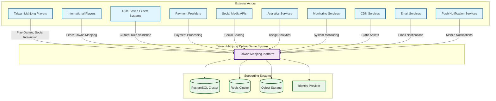

### System Context Diagram - Detailed Explanation

**Purpose & Scope:**
The System Context Diagram provides the highest-level view of the Taiwan Mahjong Online Game platform, illustrating how it interacts with external actors and supporting systems. This diagram establishes the system boundaries and identifies all external dependencies that influence architectural decisions.

**Key Actors & Their Interactions:**

**Primary Users:**
- **Taiwan Mahjong Players**: Core user base familiar with traditional 16-tile rules, requiring authentic gameplay experience with real-time multiplayer capabilities
- **International Players**: Secondary audience learning Taiwan Mahjong, needing tutorial systems and cultural context
- **Rule-Based Expert Systems**: Cultural authentication services that validate Taiwan Mahjong rule authenticity and provide expert-approved opponent behavior patterns

**External Service Dependencies:**
- **Payment Providers**: Critical for monetization through multiple regional payment methods (Stripe, PayPal, Alipay)
- **Social Media APIs**: Enable social login, sharing achievements, and community building
- **Analytics Services**: Provide business intelligence and user behavior insights for product optimization
- **CDN Services**: Ensure global performance with localized asset delivery
- **Communication Services**: Handle email notifications and mobile push notifications for engagement

**Supporting Infrastructure:**
- **PostgreSQL Cluster**: Primary data store with ACID compliance for game integrity
- **Redis Cluster**: High-performance caching and session management
- **Object Storage**: Scalable storage for game assets, replays, and user-generated content
- **Identity Provider**: Centralized authentication and authorization services

**Key Interactions & Connection Analysis:**

**Player-to-System Connections:**
- **Taiwan Mahjong Players → Core Platform**: Bidirectional real-time communication for authentic gameplay with <70ms latency requirements, WebSocket connections for live game state, secure authentication for competitive integrity
- **International Players → Core Platform**: Educational flows with tutorial systems, cultural context delivery, progressive difficulty adaptation, and community integration features

**External Service Integration Patterns:**
- **Core Platform ↔ Payment Providers**: Secure transaction processing with PCI DSS compliance, webhook notifications for payment status, subscription management, and fraud detection integration
- **Core Platform ↔ Social Media APIs**: OAuth authentication flows, social graph integration for friend discovery, content sharing with privacy controls, and marketing campaign coordination
- **Core Platform ↔ Analytics Services**: Real-time event streaming for user behavior analysis, funnel optimization data, A/B testing result aggregation, and business intelligence dashboard feeds
- **Core Platform ↔ Rule-Based Expert Systems**: Cultural rule validation, traditional pattern verification, expert-approved opponent configurations, authentic Taiwan Mahjong behavior encoding

**Critical Supporting System Dependencies:**
- **Core Platform ↔ PostgreSQL Cluster**: ACID-compliant transactions for game integrity, read/write splitting for performance, automated backup coordination, and disaster recovery synchronization
- **Core Platform ↔ Redis Cluster**: Sub-millisecond cache access for game state, session management, pub/sub messaging for real-time features, and distributed locking for consistency
- **Core Platform ↔ Object Storage**: Asset delivery optimization, game replay storage, user-generated content management, and global CDN integration
- **Core Platform ↔ Identity Provider**: Centralized authentication with SSO capabilities, authorization policy enforcement, audit logging, and compliance reporting

**Communication Protocol Significance:**
- **Solid Lines**: Synchronous, mission-critical communications requiring immediate response and guaranteed delivery
- **Dashed Lines**: Asynchronous integrations with retry mechanisms, eventual consistency tolerance, and graceful degradation capabilities

**Architectural Implications:**
This context establishes that the Taiwan Mahjong platform must be designed as a globally distributed system with strong data consistency requirements, multi-regional compliance (GDPR, local data residency), and integration capabilities with diverse external services while maintaining security boundaries and cultural authenticity.

---

## 2. Container Architecture Diagram

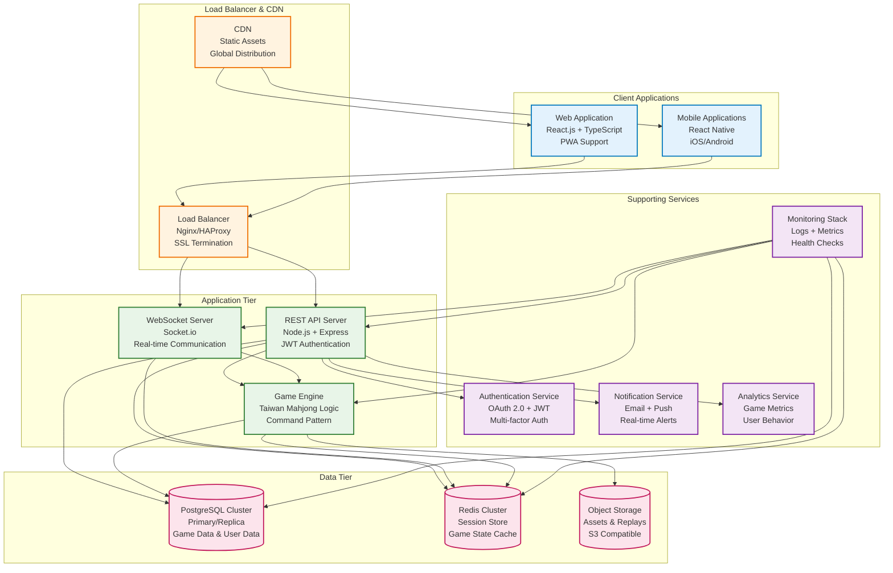

### Container Architecture Diagram - Detailed Explanation

**Purpose & Design Philosophy:**
The Container Architecture Diagram illustrates the physical deployment structure of the Taiwan Mahjong platform, showing how different logical components are packaged into deployable containers and how they communicate. This architecture follows a modular monolith approach with clear separation of concerns and independent scalability.

**Client Applications Tier:**
- **Web Application**: React.js-based Progressive Web App (PWA) providing desktop and mobile web experience with offline capabilities, service workers for caching, and responsive design for various screen sizes
- **Mobile Applications**: React Native apps for iOS/Android with platform-specific optimizations, native device integrations (camera, contacts, push notifications), and shared business logic with the web client

**Infrastructure & Load Balancing:**
- **Load Balancer (Nginx/HAProxy)**: Acts as the single entry point with SSL termination, request routing, health checking, and DDoS protection. Implements sticky sessions for WebSocket connections and distributes load across multiple application instances
- **CDN Integration**: Global content delivery network for static assets (game sprites, audio, UI assets) with edge caching, image optimization, and geographic distribution to minimize latency worldwide

**Application Tier - Modular Services:**
- **REST API Server**: Handles HTTP requests with JWT authentication, input validation, rate limiting, and API versioning. Processes game actions, user management, and business logic through well-defined endpoints
- **WebSocket Server**: Manages real-time bidirectional communication using Socket.io with room management, connection persistence, heartbeat monitoring, and automatic reconnection for game state synchronization
- **Game Engine**: Core Taiwan Mahjong logic processor handling rule validation, score calculation, rule-based opponent decision-making, and game state management with deterministic execution and audit trails

**Data Tier - High Availability:**
- **PostgreSQL Cluster**: Primary/replica configuration with automated failover, read scaling, connection pooling, and backup management. Stores user data, game history, statistics, and configuration with ACID compliance
- **Redis Cluster**: Distributed caching system for session storage, game state caching, real-time data, and pub/sub messaging with high availability and automatic sharding
- **Object Storage**: S3-compatible storage for game assets, replay files, user uploads, and backups with versioning, lifecycle management, and cross-region replication

**Supporting Services:**
- **Authentication Service**: Centralized identity management with OAuth 2.0, multi-factor authentication, JWT token management, and integration with social login providers
- **Notification Service**: Handles email and push notifications with template management, delivery tracking, and multi-channel communication (SMS, in-app, push)
- **Analytics Service**: Real-time data processing for user behavior tracking, game metrics, business intelligence, and performance monitoring with data pipeline integration
- **Monitoring Stack**: Comprehensive observability with metrics collection, log aggregation, distributed tracing, alerting, and health checking across all containers

**Container Communication Patterns:**
- **Synchronous Communication**: Direct API calls between containers for immediate response requirements (game actions, authentication)
- **Asynchronous Communication**: Event-driven messaging through Redis pub/sub for non-critical operations (notifications, analytics)
- **Data Access Patterns**: Read/write splitting with primary database for writes and read replicas for queries, with intelligent routing based on data consistency requirements

**Critical Container Interactions & Connection Analysis:**

**Client-to-Infrastructure Flow:**
- **Web/Mobile Apps → Load Balancer**: HTTPS termination with SSL/TLS 1.3, HTTP/2 multiplexing, connection persistence for WebSocket upgrades, geographic routing optimization, and DDoS protection activation
- **Load Balancer → API/WebSocket Servers**: Intelligent routing with health check validation, sticky session management for WebSocket connections, request distribution algorithms (round-robin, least connections), and automatic failover on container failure

**Application Tier Inter-Container Communication:**
- **API Server ↔ Game Engine**: Synchronous REST calls for game action validation, asynchronous command queuing for complex operations, shared context through Redis, and transaction coordination for multi-step game operations
- **WebSocket Server ↔ Game Engine**: Real-time bidirectional communication through internal message queues, game state synchronization, player action broadcasting, and connection state management across server instances
- **API Server ↔ WebSocket Server**: Session validation sharing through Redis, user authentication propagation, room membership coordination, and cross-server messaging for global announcements

**Data Layer Access Patterns:**
- **Application Containers → PostgreSQL**: Connection pooling with pgpool-ii, read/write splitting for query optimization, transaction management for data consistency, and automatic reconnection handling during database failover
- **Application Containers → Redis**: Distributed cache access with consistent hashing, pub/sub messaging for real-time features, session sharing across container instances, and distributed locking for critical operations
- **Application Containers → Object Storage**: Direct S3 API calls for asset serving, multipart upload for large files, CDN invalidation triggers, and lifecycle management automation

**Supporting Service Integration:**
- **API Server ↔ Authentication Service**: JWT validation requests, user profile synchronization, authorization policy checks, and audit event logging for security compliance
- **Game Engine ↔ Notification Service**: Game event triggers for push notifications, email campaigns for user engagement, achievement unlocks, and social sharing prompts
- **All Containers ↔ Monitoring Stack**: Metrics export via Prometheus endpoints, structured log streaming to centralized logging, distributed trace span creation, and health check endpoint exposure

**Network Communication Security:**
- **Internal Network Isolation**: VPC private subnets for application containers, security groups for port-level access control, network ACLs for subnet-level filtering, and encrypted inter-service communication
- **Service Mesh Integration**: Istio sidecar proxies for service-to-service encryption, traffic policy enforcement, observability data collection, and circuit breaker implementation

**Container Scaling Coordination:**
- **Auto-Scaling Triggers**: CloudWatch metrics for CPU/memory thresholds, custom metrics for game session counts, application-specific metrics for queue lengths, and predictive scaling based on usage patterns
- **Deployment Orchestration**: Rolling updates with health check validation, blue-green deployment coordination, canary release management, and automatic rollback on failure detection

**Data Consistency & State Management:**
- **Stateless Application Design**: Session state externalized to Redis, database connection pooling, shared configuration through environment variables, and immutable container images
- **State Synchronization**: Redis pub/sub for cross-container messaging, database transactions for atomicity, eventual consistency patterns for non-critical data, and conflict resolution mechanisms

**Scalability & Resilience:**
Each container can scale independently based on demand patterns, with auto-scaling groups, health checks, circuit breakers, and graceful degradation. The architecture supports zero-downtime deployments and automatic failover mechanisms.

---

## 3. Component Architecture Diagram

```mermaid
graph TB
    subgraph "Frontend Components"
        subgraph "Web Application (React)"
            WEB_AUTH[Authentication<br/>Login/Register<br/>Profile Management]
            WEB_LOBBY[Game Lobby<br/>Room Management<br/>Matchmaking UI]
            WEB_GAME[Game Interface<br/>Mahjong Board<br/>Player Actions]
            WEB_SOCIAL[Social Features<br/>Friends/Chat<br/>Statistics]
            WEB_SHARED[Shared Components<br/>UI Library<br/>State Management]
        end
        
        subgraph "Mobile Application (React Native)"
            MOB_AUTH[Authentication<br/>Biometric Login<br/>Social Login]
            MOB_LOBBY[Game Lobby<br/>Touch Optimized<br/>Push Notifications]
            MOB_GAME[Game Interface<br/>Gesture Controls<br/>Offline Support]
            MOB_SOCIAL[Social Features<br/>Voice Chat<br/>Camera Integration]
            MOB_SHARED[Shared Components<br/>Cross-platform<br/>Native Bridges]
        end
    end
    
    subgraph "Backend Modules (Node.js + TypeScript)"
        subgraph "Authentication Module"
            AUTH_CTRL[Auth Controller<br/>REST Endpoints<br/>JWT Management]
            AUTH_SVC[Auth Service<br/>User Validation<br/>Session Management]
            AUTH_REPO[User Repository<br/>Data Access<br/>Password Security]
        end
        
        subgraph "Game Core Module"
            GAME_CTRL[Game Controller<br/>Game Operations<br/>State Validation]
            GAME_ENGINE[Taiwan Mahjong Engine<br/>Rule Processing<br/>Rule-Based Opponents]
            GAME_STATE[Game State Manager<br/>Turn Management<br/>Score Calculation]
            GAME_REPO[Game Repository<br/>Match History<br/>Statistics Storage]
        end
        
        subgraph "Lobby Module"
            LOBBY_CTRL[Lobby Controller<br/>Room Operations<br/>Player Matching]
            LOBBY_SVC[Lobby Service<br/>Matchmaking Logic<br/>Room Management]
            LOBBY_WS[WebSocket Handler<br/>Real-time Updates<br/>Connection Management]
        end
        
        subgraph "Social Module"
            SOCIAL_CTRL[Social Controller<br/>Friends/Chat API<br/>Profile Management]
            SOCIAL_SVC[Social Service<br/>Relationship Logic<br/>Communication]
            SOCIAL_REPO[Social Repository<br/>Friend Networks<br/>Chat History]
        end
    end
    
    subgraph "Shared Infrastructure"
        DATABASE[Database Layer<br/>PostgreSQL<br/>Connection Pool]
        CACHE[Caching Layer<br/>Redis<br/>Session Store]
        EVENTS[Event System<br/>Internal Messaging<br/>Module Communication]
        LOGGING[Logging System<br/>Structured Logs<br/>Error Tracking]
        MONITORING[Monitoring<br/>Metrics Collection<br/>Health Checks]
    end
    
    %% Frontend to Backend connections
    WEB_AUTH --> AUTH_CTRL
    WEB_LOBBY --> LOBBY_CTRL
    WEB_GAME --> GAME_CTRL
    WEB_SOCIAL --> SOCIAL_CTRL
    
    MOB_AUTH --> AUTH_CTRL
    MOB_LOBBY --> LOBBY_CTRL
    MOB_GAME --> GAME_CTRL
    MOB_SOCIAL --> SOCIAL_CTRL
    
    %% WebSocket connections
    WEB_LOBBY --> LOBBY_WS
    WEB_GAME --> LOBBY_WS
    MOB_LOBBY --> LOBBY_WS
    MOB_GAME --> LOBBY_WS
    
    %% Backend internal connections
    AUTH_CTRL --> AUTH_SVC
    AUTH_SVC --> AUTH_REPO
    
    GAME_CTRL --> GAME_ENGINE
    GAME_ENGINE --> GAME_STATE
    GAME_CTRL --> GAME_REPO
    
    LOBBY_CTRL --> LOBBY_SVC
    LOBBY_WS --> LOBBY_SVC
    
    SOCIAL_CTRL --> SOCIAL_SVC
    SOCIAL_SVC --> SOCIAL_REPO
    
    %% Infrastructure connections
    AUTH_REPO --> DATABASE
    GAME_REPO --> DATABASE
    SOCIAL_REPO --> DATABASE
    
    AUTH_SVC --> CACHE
    GAME_STATE --> CACHE
    LOBBY_SVC --> CACHE
    
    GAME_ENGINE --> EVENTS
    LOBBY_SVC --> EVENTS
    SOCIAL_SVC --> EVENTS
    
    AUTH_CTRL --> LOGGING
    GAME_CTRL --> LOGGING
    LOBBY_CTRL --> LOGGING
    SOCIAL_CTRL --> LOGGING
    
    MONITORING --> DATABASE
    MONITORING --> CACHE
    MONITORING --> EVENTS
    
    classDef frontend fill:#e3f2fd,stroke:#1976d2,stroke-width:2px
    classDef backend fill:#e8f5e8,stroke:#388e3c,stroke-width:2px
    classDef shared fill:#fff3e0,stroke:#f57c00,stroke-width:2px
    
    class WEB_AUTH,WEB_LOBBY,WEB_GAME,WEB_SOCIAL,WEB_SHARED,MOB_AUTH,MOB_LOBBY,MOB_GAME,MOB_SOCIAL,MOB_SHARED frontend
    class AUTH_CTRL,AUTH_SVC,AUTH_REPO,GAME_CTRL,GAME_ENGINE,GAME_STATE,GAME_REPO,LOBBY_CTRL,LOBBY_SVC,LOBBY_WS,SOCIAL_CTRL,SOCIAL_SVC,SOCIAL_REPO backend
    class DATABASE,CACHE,EVENTS,LOGGING,MONITORING shared
```

### Component Architecture Diagram - Detailed Explanation

**Purpose & Design Philosophy:**
The Component Architecture Diagram provides a detailed internal view of the Taiwan Mahjong platform, showing how individual components are organized within the frontend and backend systems. This design follows Clean Architecture principles with Domain-Driven Design (DDD) patterns, ensuring maintainable, testable, and scalable code organization.

**Frontend Components Architecture:**

**Web Application Components (React.js):**
- **Authentication Components**: Handle user login/registration with form validation, OAuth integration, multi-factor authentication flows, password recovery, and session management. Includes secure token storage and automatic token refresh mechanisms
- **Game Lobby Components**: Manage room creation, joining, player matchmaking, spectator mode, and game configuration. Features real-time player presence, room browsing, invitation systems, and tournament organization
- **Game Interface Components**: Render the 3D mahjong table using Three.js, handle tile interactions, display game state, manage player actions (摸牌/打牌/吃碰槓胡), and provide real-time game updates with smooth animations and responsive controls
- **Social Features Components**: Implement friend systems, chat interfaces, player profiles, statistics dashboards, achievement displays, and social sharing capabilities
- **Shared Components**: Reusable UI library with consistent design system, state management with Redux Toolkit, routing, error handling, loading states, and accessibility features

**Mobile Application Components (React Native):**
- **Authentication Components**: Optimized for mobile with biometric login support, social login integration, device-specific security features, and streamlined registration flows
- **Game Lobby Components**: Touch-optimized interfaces with swipe gestures, push notification integration, offline mode support, and mobile-specific UI patterns
- **Game Interface Components**: Gesture-based controls for tile manipulation, haptic feedback, optimized 3D rendering for mobile GPUs, battery optimization, and adaptive quality settings
- **Social Features Components**: Voice chat integration, camera features for avatar photos, contact synchronization, and mobile-specific social interactions
- **Shared Components**: Cross-platform code sharing with React Native bridges, platform-specific native modules, and performance optimizations

**Backend Modules Architecture:**

**Authentication Module (DDD Context):**
- **Auth Controller**: REST API endpoints for authentication operations with proper HTTP status codes, request validation, rate limiting, and security headers
- **Auth Service**: Business logic for user validation, password hashing, JWT token generation/validation, session management, and security policy enforcement
- **User Repository**: Data access layer with encrypted password storage, user profile management, audit logging, and GDPR compliance features

**Game Core Module (DDD Context):**
- **Game Controller**: Handles game operation endpoints with state validation, command processing, error handling, and response formatting
- **Taiwan Mahjong Engine**: Core game logic implementing authentic Taiwan Mahjong rules, tile validation, scoring calculations (台數), special situations (搶槓, 詐胡, 過水), and deterministic game state management
- **Game State Manager**: Real-time game state synchronization, turn management, timer handling, player action validation, and game history tracking
- **Game Repository**: Persistent storage for match history, player statistics, game replays, and analytics data with efficient querying and data archival

**Lobby Module (DDD Context):**
- **Lobby Controller**: Room management API endpoints with player matching, room configuration, spectator controls, and tournament management
- **Lobby Service**: Matchmaking algorithms, room lifecycle management, player skill rating systems, and waiting queue optimization
- **WebSocket Handler**: Real-time communication management with connection pooling, message routing, room broadcasting, and connection state monitoring

**Social Module (DDD Context):**
- **Social Controller**: API endpoints for friend management, chat operations, profile updates, and social feature access
- **Social Service**: Friend relationship logic, chat message processing, content moderation, notification triggers, and social graph management
- **Social Repository**: Storage for friend networks, chat history, player profiles, social interactions, and privacy settings

**Shared Infrastructure Components:**

**Database Layer**: PostgreSQL connection management with connection pooling, transaction handling, query optimization, migration management, and backup coordination

**Caching Layer**: Redis integration with intelligent caching strategies, cache invalidation, session storage, real-time data management, and distributed cache coordination

**Event System**: Internal messaging system for loose coupling between modules, event publishing/subscribing, asynchronous processing, and cross-module communication

**Logging System**: Structured logging with correlation IDs, log levels, error tracking, performance monitoring, and centralized log aggregation

**Monitoring System**: Health checks, metrics collection, performance monitoring, alerting, and system observability across all components

**Component Communication Patterns:**
- **Frontend-Backend**: RESTful APIs for standard operations, WebSocket connections for real-time features, proper error handling, and loading state management
- **Inter-Module Backend**: Event-driven communication for loose coupling, direct service calls for immediate consistency, and well-defined module boundaries
- **Infrastructure Integration**: Repository pattern for data access, service layer abstraction, dependency injection, and configuration management

**Component Interactions & Connection Analysis:**

**Frontend-to-Backend Communication Patterns:**
- **React Components → REST Controllers**: HTTP/HTTPS requests with JWT token authentication, request/response cycle with proper error handling, loading state management, and retry mechanisms for network failures
- **Redux Actions → API Endpoints**: Thunk middleware for asynchronous operations, action creators with payload validation, response normalization for state updates, and optimistic UI updates with rollback capability
- **WebSocket Connections → Real-time Handlers**: Persistent bidirectional connections with automatic reconnection, message queuing during disconnects, heartbeat ping/pong for connection health, and graceful degradation during network issues

**Cross-Platform Code Sharing Mechanisms:**
- **Shared Business Logic**: TypeScript interfaces and types shared between web and mobile, validation schemas using Joi/Yup libraries, utility functions with platform-agnostic implementations, and API client libraries with consistent error handling
- **State Management Synchronization**: Redux stores with identical structure, action creators with platform-specific implementations, middleware for platform-specific side effects, and selector functions for optimized data access

**Backend Module Inter-Communication:**
- **Controller → Service Layer**: Dependency injection for service access, request context propagation, transaction boundary management, and error propagation with proper HTTP status codes
- **Service → Repository Pattern**: Data access abstraction with interface definitions, query builder integration, caching layer management, and database transaction coordination
- **Cross-Module Communication**: Domain events for loose coupling, message queues for asynchronous operations, shared kernel for common utilities, and anti-corruption layers for external service integration

**Taiwan Mahjong Game Engine Internal Flow:**
- **Game Controller → Mahjong Engine**: Command pattern for game actions (摸牌/draw, 打牌/discard, 吃/chow, 碰/pong, 槓/kong, 胡/win), state machine transitions for game phases, rule validation engine integration, and scoring calculation coordination
- **Mahjong Engine → Game State Manager**: Real-time state synchronization across players, turn management with timeout handling, game history recording for replay functionality, and consistency checks for anti-cheat protection
- **Game State → Cache/Database**: Hot data in Redis for immediate access, cold data in PostgreSQL for persistence, write-through caching for consistency, and lazy loading for historical data

**Authentication & Authorization Flow:**
- **Frontend Auth → Backend Auth Controller**: Login/registration requests with CSRF protection, OAuth 2.0 authorization code flow, password reset workflows, and multi-factor authentication integration
- **Auth Service → User Repository**: Credential validation with bcrypt hashing, session management with Redis storage, role-based access control (RBAC), and audit logging for security events
- **JWT Token Propagation**: Token inclusion in HTTP headers, automatic token refresh mechanisms, token validation middleware, and secure token storage in HTTP-only cookies

**Real-time Communication Architecture:**
- **WebSocket Handler → Lobby Service**: Room creation/joining events, player matchmaking coordination, spectator mode management, and tournament bracket updates
- **Lobby Service → Game Engine**: Game initiation triggers, player assignment coordination, game configuration propagation, and completion notification handling
- **Pub/Sub Messaging**: Redis channels for room-specific messaging, global announcements distribution, player status updates, and system maintenance notifications

**Social Features Integration:**
- **Social Controller → Friend Management**: Friend request workflows, relationship status updates, privacy setting enforcement, and social graph optimization
- **Chat System Integration**: Real-time message delivery, content moderation filtering, emoji/sticker support, and chat history persistence
- **Notification Triggers**: Achievement unlocks, friend activity updates, game invitations, and tournament announcements

**Data Flow Optimization Patterns:**
- **Caching Strategy**: L1 cache in application memory, L2 cache in Redis, database query result caching, and CDN for static assets
- **Query Optimization**: Database index utilization, query plan analysis, connection pooling management, and read replica distribution
- **Event Sourcing**: Command logging for game actions, event replay capabilities, audit trail generation, and temporal data queries

**Error Handling & Resilience Patterns:**
- **Circuit Breaker Implementation**: Service degradation during failures, automatic recovery mechanisms, fallback strategies, and health check integration
- **Retry Mechanisms**: Exponential backoff for transient failures, dead letter queues for failed messages, idempotency keys for duplicate prevention, and correlation IDs for request tracing
- **Graceful Degradation**: Feature toggling during outages, cached response serving, offline mode support, and user communication during issues

**Security Boundary Enforcement:**
- **Input Validation**: Schema validation at API boundaries, SQL injection prevention, XSS protection, and CSRF token validation
- **Authentication Propagation**: JWT token validation at each service boundary, role-based authorization checks, and audit logging for access attempts
- **Data Encryption**: In-transit encryption with TLS 1.3, at-rest encryption for sensitive data, key rotation policies, and certificate management

**Design Principles Applied:**
- **Single Responsibility**: Each component has a focused purpose and clear responsibility
- **Dependency Inversion**: Dependencies point toward abstractions, not concretions
- **Interface Segregation**: Components depend only on interfaces they actually use
- **Open/Closed Principle**: Components are open for extension but closed for modification

---

## 4. Data Flow Diagrams

### 4.1 Game Session Data Flow

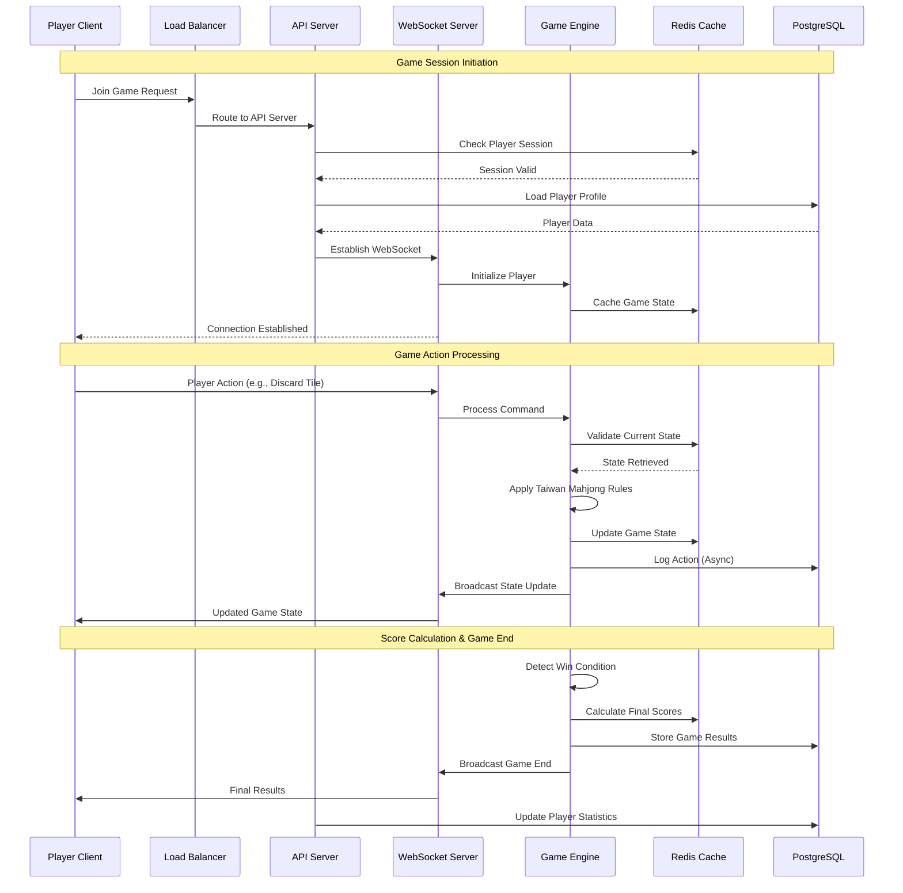

### 4.2 User Authentication Data Flow

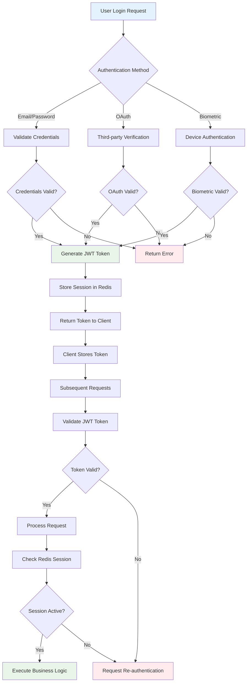

### 4.3 Real-time Communication Data Flow

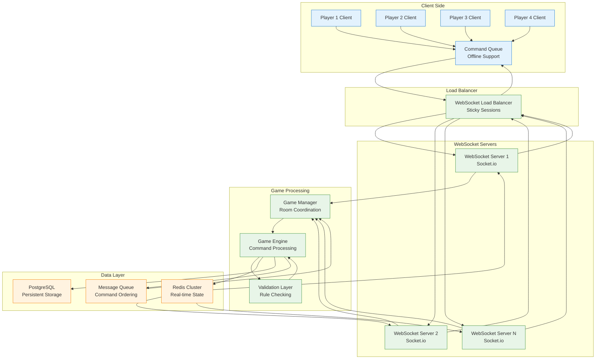

### Data Flow Diagrams - Detailed Explanation

**Purpose & Critical Importance:**
The Data Flow Diagrams illustrate how information moves through the Taiwan Mahjong system during critical operations. These diagrams are essential for understanding system behavior, identifying potential bottlenecks, ensuring data consistency, and designing proper error handling and recovery mechanisms.

**4.1 Game Session Data Flow Analysis:**

**Game Initiation Flow:**
The sequence begins when a player requests to join a game, triggering a complex orchestration of services. The Load Balancer routes the request to an available API server, which first validates the player's session in Redis cache for fast authentication. Upon validation, the system retrieves the complete player profile from PostgreSQL, including game preferences, statistics, and security settings. The API server then coordinates with the WebSocket server to establish a persistent real-time connection, while the Game Engine initializes the player's context and caches the current game state in Redis for rapid access.

**Real-time Action Processing:**
During gameplay, player actions (such as discarding a tile) flow through a carefully orchestrated validation pipeline. The WebSocket server receives the action and immediately forwards it to the Game Engine, which first retrieves the current game state from Redis cache to ensure context awareness. The Game Engine then applies authentic Taiwan Mahjong rules validation, checking for legal moves, turn order, and special conditions (過水, 搶槓, 詐胡). Upon successful validation, the system updates the game state in Redis cache and asynchronously logs the action to PostgreSQL for audit and replay purposes. The updated game state is then broadcast to all connected players via WebSocket.

**Score Calculation & Game Completion:**
When a win condition is detected, the Game Engine initiates the scoring calculation process using authentic Taiwan Mahjong台數 (tai) calculation rules. Final scores are computed and cached in Redis, while game results are persistently stored in PostgreSQL. The system broadcasts final results to all players and triggers asynchronous updates to player statistics and rankings.

**4.2 User Authentication Data Flow Analysis:**

**Multi-Modal Authentication Processing:**
The authentication system supports multiple authentication methods through a unified flow. Email/password authentication involves credential validation against encrypted storage, while OAuth flows redirect to third-party providers for verification. Biometric authentication utilizes device-specific security features. Successful authentication results in JWT token generation with appropriate claims, session storage in Redis for fast access, and token delivery to the client.

**Session Management & Security:**
Subsequent requests include JWT token validation with signature verification, expiration checking, and Redis session lookup for additional security context. Invalid or expired tokens trigger re-authentication workflows, while valid requests proceed with authorized business logic execution.

**4.3 Real-time Communication Data Flow Analysis:**

**Client-Side Resilience:**
The Command Queue on client devices provides crucial network resilience by buffering player actions during network instabilities. Commands are queued locally and transmitted when connectivity is restored, ensuring no game actions are lost during mobile network transitions or temporary disconnections.

**Load Balancing & Scaling:**
The WebSocket Load Balancer implements sticky sessions to maintain connection persistence while distributing new connections across multiple WebSocket server instances. This approach enables horizontal scaling while preserving real-time communication integrity.

**Game Processing Pipeline:**
The Game Manager coordinates room-level operations and routes commands to the appropriate Game Engine instances. Each command passes through a Validation Layer that applies Taiwan Mahjong rules before execution. The processed results flow through Redis Cluster for state management, PostgreSQL for persistence, and Message Queue for command ordering and transaction management.

**Data Consistency & Recovery:**
The Message Queue ensures command ordering and provides transaction-like behavior for game state changes. Redis Cluster maintains real-time state with high availability, while PostgreSQL provides authoritative source of truth for permanent data. This multi-tier approach ensures both performance and data integrity.

**Architectural Implications:**
These data flows demonstrate the system's ability to handle complex, stateful, real-time interactions while maintaining data consistency, performance, and resilience. The flows support the critical requirements of Taiwan Mahjong gameplay including precise rule enforcement, real-time multiplayer synchronization, and cultural authenticity in game mechanics.

---

## 5. Integration Architecture Diagram

```mermaid
graph TB
    subgraph "Taiwan Mahjong Core System"
        API[API Gateway<br/>REST + GraphQL<br/>Rate Limiting]
        AUTH[Authentication Service<br/>JWT + OAuth 2.0<br/>Multi-factor Auth]
        GAME[Game Service<br/>Taiwan Mahjong Logic<br/>Real-time Engine]
        SOCIAL[Social Service<br/>Friends + Chat<br/>Community Features]
        USER[User Service<br/>Profile Management<br/>Preferences]
        NOTIFY[Notification Service<br/>Push + Email<br/>In-app Alerts]
    end
    
    subgraph "External Integrations"
        subgraph "Payment Systems"
            STRIPE[Stripe<br/>Card Payments<br/>Subscriptions]
            PAYPAL[PayPal<br/>Digital Wallet<br/>International]
            ALIPAY[Alipay<br/>Asian Markets<br/>Mobile Payments]
        end
        
        subgraph "Social Platforms"
            FACEBOOK[Facebook<br/>Social Login<br/>Sharing]
            GOOGLE[Google<br/>OAuth + Analytics<br/>Play Games]
            WECHAT[WeChat<br/>Chinese Social<br/>Mini Programs]
        end
        
        subgraph "Cloud Services"
            AWS_S3[AWS S3<br/>Asset Storage<br/>Game Replays]
            AWS_SES[AWS SES<br/>Email Service<br/>Templates]
            AWS_SNS[AWS SNS<br/>Push Notifications<br/>Multi-platform]
        end
        
        subgraph "Analytics & Monitoring"
            MIXPANEL[Mixpanel<br/>User Analytics<br/>Funnel Analysis]
            SENTRY[Sentry<br/>Error Tracking<br/>Performance]
            DATADOG[Datadog<br/>Infrastructure<br/>APM]
        end
        
        subgraph "Rule-Based Expert Services"
            RULE_ENGINE[Rule Engine<br/>Expert Opponents<br/>Cultural Validation]
            CULTURAL_VALIDATOR[Cultural Validator<br/>Taiwan Expert Rules<br/>Authenticity Check]
        end
    end
    
    subgraph "Integration Protocols"
        REST[REST APIs<br/>HTTP/HTTPS<br/>JSON Payloads]
        WEBHOOK[Webhooks<br/>Event-driven<br/>Async Updates]
        GRAPHQL[GraphQL<br/>Flexible Queries<br/>Real-time Subscriptions]
        WEBSOCKET[WebSocket<br/>Bidirectional<br/>Real-time Data]
    end
    
    %% Core Service Connections
    API --> AUTH
    API --> GAME
    API --> SOCIAL
    API --> USER
    API --> NOTIFY
    
    %% Payment Integrations
    API -.->|REST API| STRIPE
    API -.->|REST API| PAYPAL
    API -.->|REST API| ALIPAY
    
    %% Social Platform Integrations
    AUTH -.->|OAuth 2.0| FACEBOOK
    AUTH -.->|OAuth 2.0| GOOGLE
    AUTH -.->|WeChat API| WECHAT
    
    SOCIAL -.->|Graph API| FACEBOOK
    SOCIAL -.->|Social API| GOOGLE
    
    %% Cloud Service Integrations
    GAME -.->|S3 API| AWS_S3
    NOTIFY -.->|SES API| AWS_SES
    NOTIFY -.->|SNS API| AWS_SNS
    
    %% Analytics Integrations
    API -.->|REST API| MIXPANEL
    API -.->|SDK| SENTRY
    API -.->|Agent| DATADOG
    
    %% Rule-Based Expert Integrations
    GAME -.->|API| RULE_ENGINE
    GAME -.->|REST| CULTURAL_VALIDATOR
    
    %% Protocol Usage
    REST -.-> API
    WEBHOOK -.-> API
    GRAPHQL -.-> API
    WEBSOCKET -.-> GAME
    
    classDef core fill:#e8f5e8,stroke:#2e7d32,stroke-width:3px
    classDef payment fill:#e3f2fd,stroke:#1976d2,stroke-width:2px
    classDef social fill:#f3e5f5,stroke:#7b1fa2,stroke-width:2px
    classDef cloud fill:#fff3e0,stroke:#f57c00,stroke-width:2px
    classDef analytics fill:#fce4ec,stroke:#c2185b,stroke-width:2px
    classDef ai fill:#e0f2f1,stroke:#00695c,stroke-width:2px
    classDef protocol fill:#f9fbe7,stroke:#827717,stroke-width:2px
    
    class API,AUTH,GAME,SOCIAL,USER,NOTIFY core
    class STRIPE,PAYPAL,ALIPAY payment
    class FACEBOOK,GOOGLE,WECHAT social
    class AWS_S3,AWS_SES,AWS_SNS cloud
    class MIXPANEL,SENTRY,DATADOG analytics
    class RULE_ENGINE,CULTURAL_VALIDATOR rule_based
    class REST,WEBHOOK,GRAPHQL,WEBSOCKET protocol
```

### Integration Architecture Diagram - Detailed Explanation

**Purpose & Strategic Importance:**
The Integration Architecture Diagram illustrates how the Taiwan Mahjong platform connects with external services and systems to provide comprehensive functionality beyond core gameplay. This architecture ensures the platform can leverage best-in-class external services while maintaining security, performance, and vendor independence.

**Core System Services:**

**API Gateway (Entry Point):**
Serves as the single point of entry for all external integrations, implementing rate limiting, request routing, authentication, API versioning, and protocol translation. The gateway provides a unified interface that abstracts internal system complexity from external partners and services.

**Authentication Service:**
Manages multi-factor authentication, OAuth 2.0 flows, JWT token lifecycle, and integration with social login providers. This centralized approach ensures consistent security policies across all authentication methods while supporting diverse regional preferences.

**Game Service:**
Contains the core Taiwan Mahjong logic, real-time engine, and rule-based expert systems. This service integrates with expert-validated rule engines for authentic opponent behavior and cultural validation while maintaining the traditional Taiwan Mahjong experience.

**Social Service & User Service:**
Handle community features, friend networks, chat systems, and player profiles. These services integrate with social platforms for login, sharing, and community building while maintaining user privacy and data sovereignty.

**Notification Service:**
Orchestrates multi-channel communication including push notifications, email campaigns, and in-app alerts. Integration with cloud services enables reliable, scalable messaging across global user bases.

**External Integration Categories:**

**Payment Systems Integration:**
- **Stripe**: Primary card payment processor supporting global markets with PCI DSS compliance, subscription management, and fraud detection
- **PayPal**: Digital wallet integration for international users with simplified checkout flows and buyer protection
- **Alipay**: Asian market focus with mobile-first payment experience and integration with super-app ecosystems

**Social Platform Integration:**
- **Facebook**: OAuth authentication, social graph access, sharing capabilities, and targeted advertising integration
- **Google**: Authentication, analytics, Play Games Services integration, and cloud services ecosystem
- **WeChat**: Critical for Chinese market access with mini-program integration, social features, and mobile payment capabilities

**Cloud Services Integration:**
- **AWS S3**: Scalable object storage for game assets, replay files, user uploads with lifecycle management and global distribution
- **AWS SES**: Enterprise email service with template management, bounce handling, and delivery analytics
- **AWS SNS**: Multi-platform push notification service with device management and message targeting

**Analytics & Monitoring Integration:**
- **Mixpanel**: User behavior analytics with funnel analysis, cohort tracking, and A/B testing capabilities for product optimization
- **Sentry**: Error tracking and performance monitoring with real-time alerting and debugging capabilities
- **Datadog**: Infrastructure monitoring with APM, log aggregation, and comprehensive observability across the entire stack

**Rule-Based Expert System Integration:**
- **Rule Engine**: Expert-validated opponent decision systems with cultural authenticity validation and traditional Taiwan Mahjong patterns
- **Cultural Validator**: Taiwan Mahjong expert consultation system for rule authenticity, traditional pattern validation, and cultural compliance verification

**Integration Protocols & Patterns:**

**REST APIs**: Standard HTTP/HTTPS communication for synchronous operations with proper status codes, error handling, and rate limiting

**Webhooks**: Event-driven asynchronous communication for real-time updates from external services, ensuring timely response to payment confirmations, social events, and system notifications

**GraphQL**: Flexible query language for complex data fetching scenarios, particularly useful for mobile clients with bandwidth constraints and varied data requirements

**WebSocket**: Bidirectional real-time communication for game state synchronization and live chat features

**Security & Reliability Considerations:**

**Vendor Independence**: All external integrations use abstraction layers and adapter patterns to prevent vendor lock-in and enable service substitution

**Circuit Breaker Pattern**: Prevents cascade failures when external services experience issues, with graceful degradation and automatic recovery

**API Rate Limiting**: Protects against abuse and ensures fair usage of external services while maintaining system stability

**Data Privacy**: All integrations comply with GDPR, CCPA, and regional data protection regulations with proper consent management and data minimization

**Monitoring & Observability**: Comprehensive logging and monitoring of all external integrations with alerting for service failures, performance degradation, and security events

**Configuration Management**: Environment-specific configurations for different integration endpoints, API keys, and feature flags enabling safe deployment across environments

**Integration Connection Analysis & Interaction Patterns:**

**Payment Integration Workflows:**
- **API Gateway → Stripe**: HTTPS requests with PCI DSS compliant token exchange, webhook endpoints for payment status updates, subscription lifecycle management, and dispute handling automation
- **API Gateway → PayPal**: OAuth 2.0 authentication flow, Express Checkout integration, IPN (Instant Payment Notification) webhook handling, and currency conversion coordination
- **API Gateway → Alipay**: Mobile SDK integration for app payments, QR code generation for web payments, real-time payment status polling, and settlement reporting integration

**Social Platform Authentication Flows:**
- **Auth Service ↔ Facebook**: OAuth 2.0 authorization code flow with PKCE, Graph API integration for profile data, friend list synchronization, and social sharing capabilities with privacy controls
- **Auth Service ↔ Google**: OpenID Connect authentication, Google Sign-In integration, Play Games Services for achievements, and Analytics data sharing with user consent
- **Auth Service ↔ WeChat**: WeChat OAuth 2.0 for Chinese users, Mini Program integration, social features through WeChat API, and payment integration with WeChat Pay

**Cloud Service Data Flows:**
- **Game Service → AWS S3**: Multipart upload for large game replay files, signed URL generation for secure downloads, lifecycle policies for data archival, and CloudFront CDN integration for global distribution
- **Notification Service → AWS SES**: Template-based email campaigns, bounce and complaint handling, reputation monitoring, and delivery analytics integration
- **Notification Service → AWS SNS**: Cross-platform push notifications, device token management, message targeting and personalization, and delivery feedback processing

**Analytics Data Pipeline:**
- **API Gateway → Mixpanel**: Real-time event streaming with user privacy controls, funnel analysis data aggregation, cohort tracking integration, and A/B testing result collection
- **Infrastructure → Sentry**: Automatic error reporting with stack traces, performance monitoring data, release tracking integration, and issue alerting workflows
- **Infrastructure → Datadog**: Metrics ingestion through StatsD protocol, log forwarding with structured data, APM trace collection, and infrastructure monitoring integration

**Rule-Based Expert Service Integration:**
- **Game Service → Rule Engine**: API calls for expert-validated opponent decision-making, cultural authenticity validation for game moves, traditional pattern verification, and rule-based coaching systems
- **Game Service → Cultural Validator**: Expert consultation requests for rule verification, traditional pattern validation queries, cultural authenticity checks, and Taiwan Mahjong compliance certification

**Protocol-Specific Connection Patterns:**

**REST API Connections:**
- Synchronous request-response patterns with HTTP status code handling
- API versioning through URL paths or headers
- Rate limiting with token bucket algorithms
- Authentication via JWT tokens or API keys
- Content negotiation for JSON/XML responses

**Webhook Integration Patterns:**
- Asynchronous event notifications from external services
- Signature verification for webhook authenticity
- Idempotency handling for duplicate events
- Retry mechanisms with exponential backoff
- Dead letter queues for failed webhook processing

**GraphQL Integration Benefits:**
- Single endpoint for complex data fetching
- Real-time subscriptions for live updates
- Field-level permissions for data security
- Query complexity analysis and limiting
- Schema stitching for federated data sources

**WebSocket Real-time Connections:**
- Persistent bidirectional communication for game state
- Connection pooling and load balancing
- Message queuing during temporary disconnects
- Heartbeat mechanisms for connection health
- Graceful fallback to HTTP long polling

**Security & Reliability Connection Safeguards:**

**Circuit Breaker Implementations:**
- Failure threshold monitoring for external services
- Automatic service degradation during outages
- Health check integration for recovery detection
- Fallback strategies for essential functions
- Metrics collection for failure pattern analysis

**Rate Limiting Strategies:**
- Token bucket algorithms for burst traffic handling
- Sliding window rate limiting for smooth distribution
- User-based and IP-based rate limiting
- Graceful degradation under rate limit violations
- Dynamic rate limit adjustment based on service health

**Data Privacy & Compliance Connections:**
- GDPR consent management integration
- Data minimization in external service calls
- Right to erasure automation across services
- Cross-border data transfer compliance
- Audit logging for regulatory requirements

**Monitoring & Alerting Integration:**
- Service health monitoring across all integrations
- SLA violation detection and alerting
- Performance degradation tracking
- Error rate monitoring with threshold alerting
- Integration cost tracking and optimization

This integration architecture enables the Taiwan Mahjong platform to provide world-class user experience while maintaining system independence, security, and scalability for global operations.

---

## 6. Deployment Architecture Diagram

```mermaid
graph TB
    subgraph "Global CDN Layer"
        CDN[CloudFlare CDN<br/>Global Edge Locations<br/>DDoS Protection]
    end
    
    subgraph "Production Environment - Primary Region (US-West)"
        subgraph "Internet Gateway"
            ALB[Application Load Balancer<br/>SSL Termination<br/>Health Checks]
            WAF[Web Application Firewall<br/>Security Rules<br/>Bot Protection]
        end
        
        subgraph "Application Tier - Auto Scaling"
            ASG1[Auto Scaling Group<br/>Web Servers<br/>2-10 instances]
            ASG2[Auto Scaling Group<br/>API Servers<br/>3-15 instances]
            ASG3[Auto Scaling Group<br/>WebSocket Servers<br/>2-8 instances]
            ASG4[Auto Scaling Group<br/>Game Engines<br/>5-20 instances]
        end
        
        subgraph "Data Tier - High Availability"
            PG_PRIMARY[PostgreSQL Primary<br/>RDS Multi-AZ<br/>Read Replicas]
            PG_REPLICA[PostgreSQL Replicas<br/>Cross-AZ Distribution<br/>Read Scaling]
            
            REDIS_CLUSTER[Redis Cluster<br/>ElastiCache<br/>Multi-AZ Replication]
            
            S3_PRIMARY[S3 Primary Bucket<br/>Game Assets<br/>Cross-Region Replication]
        end
        
        subgraph "Supporting Services"
            SECRETS[AWS Secrets Manager<br/>Database Credentials<br/>API Keys]
            LOGS[CloudWatch Logs<br/>Centralized Logging<br/>Log Analytics]
            MONITORING[CloudWatch + Datadog<br/>Metrics & Alerting<br/>APM Tracing]
            BACKUP[Automated Backups<br/>Point-in-time Recovery<br/>Cross-region Copies]
        end
    end
    
    subgraph "Disaster Recovery Region (US-East)"
        subgraph "DR Infrastructure"
            DR_ALB[DR Load Balancer<br/>Standby Configuration<br/>DNS Failover]
            DR_ASG[DR Auto Scaling<br/>Minimal Instances<br/>Scale on Failover]
            DR_PG[PostgreSQL DR<br/>Cross-region Replica<br/>Promotion Ready]
            DR_REDIS[Redis DR<br/>Backup Restoration<br/>Fast Recovery]
            DR_S3[S3 DR Bucket<br/>Cross-region Replica<br/>Automatic Sync]
        end
    end
    
    subgraph "Development & Staging"
        DEV_ENV[Development Environment<br/>Feature Branches<br/>Integration Testing]
        STAGING_ENV[Staging Environment<br/>Production Mirror<br/>Load Testing]
        CI_CD[CI/CD Pipeline<br/>GitHub Actions<br/>Automated Deployment]
    end
    
    subgraph "Mobile App Distribution"
        APP_STORE[Apple App Store<br/>iOS Distribution<br/>TestFlight Beta]
        PLAY_STORE[Google Play Store<br/>Android Distribution<br/>Internal Testing]
        PWA[Progressive Web App<br/>Service Worker<br/>App-like Experience]
    end
    
    %% Traffic Flow
    CDN --> ALB
    ALB --> WAF
    WAF --> ASG1
    WAF --> ASG2
    WAF --> ASG3
    WAF --> ASG4
    
    %% Data Connections
    ASG2 --> PG_PRIMARY
    ASG2 --> PG_REPLICA
    ASG3 --> REDIS_CLUSTER
    ASG4 --> PG_PRIMARY
    ASG4 --> REDIS_CLUSTER
    
    ASG1 --> S3_PRIMARY
    ASG2 --> S3_PRIMARY
    ASG4 --> S3_PRIMARY
    
    %% Cross-region DR
    PG_PRIMARY -.->|Async Replication| DR_PG
    S3_PRIMARY -.->|Cross-region Replication| DR_S3
    REDIS_CLUSTER -.->|Backup| DR_REDIS
    
    %% DR Failover
    CDN -.->|DNS Failover| DR_ALB
    DR_ALB -.-> DR_ASG
    DR_ASG -.-> DR_PG
    DR_ASG -.-> DR_REDIS
    DR_ASG -.-> DR_S3
    
    %% Development Flow
    CI_CD --> DEV_ENV
    CI_CD --> STAGING_ENV
    CI_CD --> ASG2
    CI_CD --> APP_STORE
    CI_CD --> PLAY_STORE
    CI_CD --> PWA
    
    %% Monitoring & Support
    MONITORING --> ASG1
    MONITORING --> ASG2
    MONITORING --> ASG3
    MONITORING --> ASG4
    MONITORING --> PG_PRIMARY
    MONITORING --> REDIS_CLUSTER
    
    LOGS --> ASG1
    LOGS --> ASG2
    LOGS --> ASG3
    LOGS --> ASG4
    
    BACKUP --> PG_PRIMARY
    BACKUP --> REDIS_CLUSTER
    BACKUP --> S3_PRIMARY
    
    SECRETS --> ASG2
    SECRETS --> ASG4
    
    classDef cdn fill:#e1f5fe,stroke:#0277bd,stroke-width:3px
    classDef network fill:#f3e5f5,stroke:#7b1fa2,stroke-width:2px
    classDef compute fill:#e8f5e8,stroke:#2e7d32,stroke-width:2px
    classDef data fill:#fff3e0,stroke:#ef6c00,stroke-width:2px
    classDef support fill:#fce4ec,stroke:#ad1457,stroke-width:2px
    classDef dr fill:#ffebee,stroke:#c62828,stroke-width:2px
    classDef dev fill:#f9fbe7,stroke:#558b2f,stroke-width:2px
    classDef mobile fill:#e8eaf6,stroke:#3f51b5,stroke-width:2px
    
    class CDN cdn
    class ALB,WAF network
    class ASG1,ASG2,ASG3,ASG4 compute
    class PG_PRIMARY,PG_REPLICA,REDIS_CLUSTER,S3_PRIMARY data
    class SECRETS,LOGS,MONITORING,BACKUP support
    class DR_ALB,DR_ASG,DR_PG,DR_REDIS,DR_S3 dr
    class DEV_ENV,STAGING_ENV,CI_CD dev
    class APP_STORE,PLAY_STORE,PWA mobile
```

### Deployment Architecture Diagram - Detailed Explanation

**Purpose & Production Readiness:**
The Deployment Architecture Diagram illustrates the production-ready infrastructure for hosting the Taiwan Mahjong platform at enterprise scale. This architecture ensures high availability, global performance, disaster recovery, and security while supporting 100,000+ concurrent users with sub-70ms response times.

**Global Infrastructure Strategy:**

**Global CDN Layer (CloudFlare):**
Provides global edge locations for static asset delivery, DDoS protection, WAF services, SSL certificate management, and intelligent routing. The CDN serves game assets, images, JavaScript bundles, and cached API responses from edge locations closest to users, reducing latency and improving user experience worldwide.

**Production Environment - Primary Region (US-West):**

**Internet Gateway & Security:**
- **Application Load Balancer**: Distributes incoming traffic across multiple availability zones with SSL termination, health checking, and automatic failover. Implements connection draining for graceful deployments and sticky sessions for WebSocket connections
- **Web Application Firewall (WAF)**: Provides layer 7 security with OWASP Top 10 protection, bot detection, rate limiting, geo-blocking, and custom security rules. Integrates with threat intelligence feeds for real-time protection updates

**Auto-Scaling Application Tier:**
- **Web Server Auto Scaling Group (2-10 instances)**: Serves static content, handles initial user requests, and provides PWA functionality. Scales based on CPU utilization and request volume with predictive scaling for traffic patterns
- **API Server Auto Scaling Group (3-15 instances)**: Processes business logic, handles authentication, manages user data, and coordinates game operations. Implements circuit breakers and bulkhead patterns for resilience
- **WebSocket Server Auto Scaling Group (2-8 instances)**: Manages real-time connections with sticky session support, connection pooling, and graceful connection migration during scaling events
- **Game Engine Auto Scaling Group (5-20 instances)**: Processes Taiwan Mahjong game logic, manages game state, and handles rule-based opponents. Scales based on active game count with predictive scaling for peak gaming hours

**High-Availability Data Tier:**
- **PostgreSQL Primary (RDS Multi-AZ)**: Provides ACID-compliant storage with automatic failover, backup management, and performance monitoring. Implements connection pooling and read replica distribution
- **PostgreSQL Read Replicas**: Cross-availability zone distribution for read scaling, query load balancing, and disaster recovery. Supports geo-distributed reads for global user base
- **Redis Cluster (ElastiCache)**: Multi-AZ replication for session storage, game state caching, and pub/sub messaging with automatic failover and data sharding
- **S3 Primary Bucket**: Game asset storage with cross-region replication, lifecycle management, and versioning for game content and user uploads

**Supporting Services:**
- **AWS Secrets Manager**: Centralized credential management with automatic rotation, encrypted storage, and fine-grained access controls
- **CloudWatch Logs**: Centralized log aggregation with structured logging, log analytics, and long-term retention for compliance and debugging
- **Monitoring Stack**: Multi-tier monitoring with CloudWatch and Datadog integration providing infrastructure metrics, application performance monitoring, and business intelligence
- **Automated Backup**: Point-in-time recovery capabilities with cross-region backup replication and automated testing of backup integrity

**Disaster Recovery Region (US-East):**

**DR Infrastructure Design:**
- **Standby Configuration**: Minimal resource allocation in DR region with ability to rapidly scale during failover events
- **Cross-Region Data Replication**: Asynchronous replication of critical data with configurable RPO targets
- **Automated Failover**: DNS-based failover with health checking and traffic routing during primary region outages
- **Recovery Automation**: Infrastructure as Code enables rapid DR environment provisioning and configuration

**Development & Staging Infrastructure:**

**Environment Parity:**
- **Development Environment**: Feature branch testing with isolated resources and rapid deployment capabilities
- **Staging Environment**: Production mirror for load testing, user acceptance testing, and deployment validation
- **CI/CD Pipeline**: GitHub Actions integration with automated testing, security scanning, and progressive deployment strategies

**Mobile Application Distribution:**

**App Distribution Strategy:**
- **Apple App Store**: iOS app distribution with TestFlight beta testing, App Store Connect integration, and automated submission processes
- **Google Play Store**: Android app distribution with internal testing tracks, Google Play Console integration, and staged rollouts
- **Progressive Web App**: Web-based mobile experience with service worker caching, offline functionality, and app-like user experience

**Deployment Patterns & Strategies:**

**Zero-Downtime Deployment:**
Blue-green deployment pattern with traffic switching, rollback capabilities, and automated health checking ensures minimal service disruption during updates.

**Security & Compliance:**
- **Network Isolation**: VPC configuration with private subnets, security groups, and network ACLs
- **Encryption**: End-to-end encryption for data in transit and at rest with key management and rotation
- **Compliance**: SOC 2, GDPR, and regional compliance requirements with audit logging and data governance

**Monitoring & Observability:**
Comprehensive monitoring covers infrastructure metrics, application performance, security events, and business metrics with real-time alerting and incident response procedures.

**Deployment Network Flow & Connection Analysis:**

**Global Traffic Routing:**
- **Users → CloudFlare CDN**: Anycast routing to nearest edge location, DNS resolution with geographic optimization, DDoS attack mitigation, and SSL/TLS termination at the edge
- **CDN → Application Load Balancer**: Cache miss requests routed to origin servers, geographic load balancing, health check propagation, and automatic failover routing

**Production Environment Data Flows:**
- **Load Balancer → Auto Scaling Groups**: HTTP/HTTPS request distribution with session stickiness, health check validation before routing, request queuing during scaling events, and connection draining during deployments
- **Auto Scaling Groups ↔ PostgreSQL**: Connection pooling management with automatic scaling, read/write split routing to appropriate database instances, transaction coordination across distributed connections, and failover handling with minimal downtime
- **Application Tier ↔ Redis Cluster**: Consistent hashing for data distribution, Redis Sentinel for master/slave coordination, cross-AZ replication for high availability, and automatic shard rebalancing

**Cross-Region Data Synchronization:**
- **Primary PostgreSQL → DR PostgreSQL**: Asynchronous streaming replication with configurable lag tolerance, automated failover promotion, point-in-time recovery coordination, and data consistency validation
- **Primary S3 → DR S3**: Cross-region replication with lifecycle policies, versioning synchronization, metadata preservation, and bandwidth throttling for cost optimization
- **Application State Synchronization**: Redis backup restoration, application configuration synchronization, and infrastructure state replication through Terraform

**Development Pipeline Connections:**
- **CI/CD → Development Environment**: Automated deployment triggers from Git commits, database migration execution, configuration management, and environment cleanup automation
- **Staging ↔ Production**: Production data synchronization for testing, performance baseline validation, security scanning integration, and deployment approval workflows

**Mobile Distribution Flows:**
- **App Store Connect → iOS Distribution**: Binary upload automation, TestFlight beta distribution, App Store review automation, and release management coordination
- **Google Play Console → Android Distribution**: APK/AAB upload automation, internal testing track management, staged rollout configuration, and crash reporting integration
- **PWA Service Worker**: Offline functionality implementation, background synchronization, push notification coordination, and app update mechanisms

**Monitoring & Alerting Connections:**
- **All Infrastructure → CloudWatch**: Metrics aggregation from EC2, RDS, ElastiCache instances, custom application metrics, log stream ingestion, and alarm threshold monitoring
- **CloudWatch → Datadog**: Metrics forwarding for advanced visualization, correlation analysis, service dependency mapping, and business intelligence integration
- **Alert Manager → PagerDuty**: Incident escalation workflows, on-call rotation management, alert de-duplication, and incident response coordination

**Security Boundary Enforcement:**
- **VPC Network Isolation**: Private subnet communication, security group rule enforcement, Network ACL filtering, and NAT Gateway routing for outbound connections
- **Secrets Manager Integration**: Automatic credential injection into applications, rotation trigger coordination, cross-service authentication, and audit logging for access tracking

**Backup & Recovery Data Flows:**
- **Database → S3 Backup Storage**: Automated backup scheduling, incremental backup coordination, encryption during transit and storage, and retention policy enforcement
- **Cross-Region Backup Replication**: Asynchronous backup copy to DR region, integrity validation, and recovery testing automation

**Cost Optimization Connection Patterns:**
- **Auto Scaling Metrics**: CloudWatch alarms triggering scaling events, predictive scaling based on historical patterns, scheduled scaling for known traffic patterns, and cost-aware instance type selection
- **Reserved Instance Optimization**: Instance type matching, availability zone optimization, term length selection, and utilization monitoring for cost effectiveness
- **Spot Instance Integration**: Non-critical workload identification, spot price monitoring, automatic instance replacement, and workload scheduling optimization

**Cost Optimization:**
Auto-scaling policies, reserved instances, spot instances for non-critical workloads, and resource optimization strategies minimize operational costs while maintaining performance and availability requirements.

---

## 7. DevOps Architecture Diagram

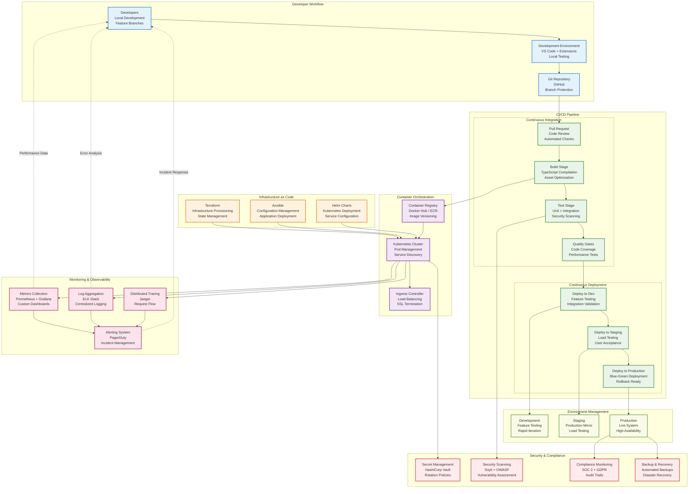

### DevOps Architecture Diagram - Detailed Explanation

**Purpose & Development Excellence:**
The DevOps Architecture Diagram illustrates the complete development lifecycle and operational practices for the Taiwan Mahjong platform. This architecture ensures rapid, reliable, and secure delivery of features while maintaining system quality, security, and operational stability through automation and best practices.

**Developer Workflow & Local Development:**

**Development Environment:**
- **Local Development Setup**: Developers work with VS Code enhanced with project-specific extensions (TypeScript, React, Node.js debugger, Git integration) providing intelligent code completion, debugging capabilities, and integrated terminal access
- **Development Environment**: Containerized local development using Docker Compose ensures environment parity with production, includes hot reloading, local database instances, and mock external services for offline development
- **Git Repository Management**: GitHub-based source control with branch protection rules, required pull request reviews, automated status checks, and merge queue management for code quality assurance

**Continuous Integration Pipeline:**

**Pull Request Workflow:**
- **Code Review Process**: Mandatory peer reviews with automated checks including code style validation, test coverage analysis, security scanning, and documentation updates
- **Automated Quality Gates**: ESLint/Prettier for code formatting, TypeScript compilation verification, unit test execution with coverage reporting, and security vulnerability scanning

**Build & Test Stages:**
- **Build Stage**: TypeScript compilation for both frontend and backend, asset optimization and bundling, Docker image creation with multi-stage builds, and dependency vulnerability scanning
- **Test Stage**: Unit test execution with >95% coverage requirement, integration testing with database and external service mocks, end-to-end testing using Playwright, and performance regression testing
- **Quality Gates**: Code coverage thresholds, performance benchmark validation, security scanning with OWASP dependency check, and accessibility testing for compliance

**Continuous Deployment Pipeline:**

**Progressive Deployment Strategy:**
- **Development Deployment**: Automatic deployment to development environment for feature validation, database migration testing, and integration verification with external services
- **Staging Deployment**: Production-like environment for user acceptance testing, load testing with realistic traffic patterns, and final security validation before production release
- **Production Deployment**: Blue-green deployment with automated traffic switching, health checks, rollback capabilities, and canary releases for gradual feature rollouts

**Infrastructure as Code Management:**

**Infrastructure Provisioning:**
- **Terraform**: Declarative infrastructure provisioning with state management, resource dependency tracking, and environment-specific configurations for AWS resources
- **Ansible**: Configuration management for application deployment, server configuration, and automated operational tasks with idempotent playbook execution
- **Helm Charts**: Kubernetes deployment templates with parameterized configurations, service discovery setup, and resource management for containerized applications

**Container Orchestration:**

**Container Management:**
- **Container Registry**: Secure image storage with vulnerability scanning, image signing, version tagging, and automated cleanup policies for Docker images
- **Kubernetes Cluster**: Container orchestration with auto-scaling, service discovery, rolling updates, health checks, and resource management for optimal resource utilization
- **Ingress Controller**: Load balancing, SSL termination, path-based routing, and traffic management for external service access

**Monitoring & Observability Integration:**

**Comprehensive Monitoring:**
- **Metrics Collection**: Prometheus for infrastructure and application metrics with custom business metrics, alerting rules, and long-term storage integration
- **Log Aggregation**: ELK Stack (Elasticsearch, Logstash, Kibana) for centralized logging with structured log parsing, search capabilities, and log retention policies
- **Distributed Tracing**: Jaeger for request flow tracing across microservices, performance bottleneck identification, and service dependency mapping
- **Alerting System**: PagerDuty integration for incident management with escalation policies, on-call rotation, and automated incident response

**Security & Compliance Integration:**

**Automated Security:**
- **Secret Management**: HashiCorp Vault for credential storage with automatic rotation, fine-grained access policies, and audit logging for compliance requirements
- **Security Scanning**: Automated vulnerability scanning with Snyk and OWASP tools integrated into CI/CD pipeline with security gate policies
- **Compliance Monitoring**: SOC 2 and GDPR compliance validation with automated policy checking, audit trail generation, and data governance enforcement
- **Backup & Recovery**: Automated backup strategies with point-in-time recovery, cross-region replication, and disaster recovery testing procedures

**Environment Management:**

**Multi-Environment Strategy:**
- **Development Environment**: Feature branch testing with rapid iteration cycles, mock external services, and debugging capabilities
- **Staging Environment**: Production parity for user acceptance testing, performance validation, and integration testing with real external services
- **Production Environment**: High-availability deployment with redundancy, monitoring, alerting, and automated scaling based on demand

**GitOps Implementation:**

**Git-Centric Operations:**
- **Infrastructure State**: All infrastructure configurations stored in Git repositories with version control, peer review, and change tracking
- **Application Configuration**: Environment-specific configurations managed through Git with automated deployment triggers and rollback capabilities
- **Policy as Code**: Security policies, compliance rules, and operational procedures defined as code with version control and automated enforcement

**Automation & Feedback Loops:**

**Continuous Improvement:**
- **Automated Testing**: Comprehensive test automation covering unit, integration, end-to-end, security, and performance testing with fast feedback cycles
- **Performance Monitoring**: Continuous performance tracking with automated optimization suggestions, capacity planning, and performance regression detection
- **Incident Response**: Automated incident detection, notification, and response procedures with post-mortem analysis and process improvement

**DevOps Pipeline Connection Analysis & Workflow Integration:**

**Developer-to-Production Flow:**
- **Developer → IDE → Git**: Local development with hot reloading, integrated debugging, code completion, and automated formatting. Git commits trigger pre-commit hooks with linting, testing, and security scanning
- **Git → Pull Request**: Branch protection rules enforce code review requirements, automated status checks run CI pipeline, merge queue management prevents conflicts, and squash-and-merge maintains clean history
- **Pull Request → CI Pipeline**: GitHub Actions workflows triggered by PR events, parallel execution of build/test/quality stages, status reporting back to PR, and artifact generation for deployment

**Continuous Integration Workflow Connections:**
- **Build Stage → Test Stage**: Docker image creation with multi-stage builds, dependency installation and caching, TypeScript compilation validation, and asset optimization for production deployment
- **Test Stage → Quality Gates**: Unit test execution with coverage reporting, integration test coordination with test databases, security vulnerability scanning, and performance regression testing
- **Quality Gates → Deployment Trigger**: Code coverage threshold validation, performance benchmark comparison, security gate approval, and automated deployment authorization

**Infrastructure Management Connections:**
- **Terraform → Cloud Provider APIs**: Infrastructure provisioning with state management, resource dependency resolution, environment-specific variable injection, and drift detection with automatic correction
- **Ansible → Target Servers**: SSH-based configuration management, idempotent playbook execution, application deployment coordination, and service restart automation
- **Helm → Kubernetes API**: Chart-based deployment with templating, release management with rollback capabilities, service discovery configuration, and resource quota management

**Container Orchestration Flow:**
- **CI Pipeline → Container Registry**: Docker image building with security scanning, vulnerability assessment, image signing for authenticity, and automated cleanup of old images
- **Registry → Kubernetes**: Image pull with authentication, pod scheduling across nodes, rolling update coordination, and health check validation before traffic routing
- **Kubernetes → Ingress Controller**: Service discovery and registration, load balancing configuration, SSL certificate management, and traffic routing rules

**Environment Promotion Pipeline:**
- **Development → Staging**: Automated deployment on merge to main branch, database migration execution, integration test suite execution, and environment configuration validation
- **Staging → Production**: Manual approval gates with stakeholder review, blue-green deployment coordination, canary release management, and automated rollback on failure detection
- **Production Monitoring → Feedback Loop**: Real-time performance monitoring, error rate tracking, user behavior analysis, and automated alerts for development team

**Monitoring & Observability Integration:**
- **Application → Prometheus**: Metrics export via /metrics endpoints, custom business metric collection, alert rule evaluation, and time-series data storage
- **Infrastructure → ELK Stack**: Log forwarding from all services, structured log parsing, search index optimization, and log retention policy management
- **Distributed Traces → Jaeger**: Trace span generation across service boundaries, performance bottleneck identification, service dependency mapping, and request flow visualization
- **Alert Manager → PagerDuty**: Alert aggregation and deduplication, escalation policy execution, on-call rotation management, and incident tracking integration

**Security Pipeline Integration:**
- **Code → Security Scanning**: SAST (Static Application Security Testing) during CI, dependency vulnerability scanning, secret detection in code commits, and license compliance checking
- **Infrastructure → Vault**: Secret retrieval during deployment, credential rotation automation, certificate management, and audit trail generation for compliance
- **Production → Compliance Monitoring**: SOC 2 control validation, GDPR compliance checking, access audit logging, and regulatory report generation

**Feedback & Continuous Improvement Loops:**
- **Production Metrics → Development Planning**: Performance data analysis for optimization opportunities, error pattern identification for bug fixes, user behavior insights for feature development, and capacity planning for infrastructure scaling
- **Incident Response → Process Improvement**: Post-mortem analysis documentation, process refinement based on lessons learned, automation opportunities identification, and knowledge sharing across teams
- **Performance Monitoring → Optimization**: Automatic performance regression detection, optimization suggestion generation, resource usage analysis, and cost optimization recommendations

**GitOps State Management:**
- **Git Repository → Infrastructure State**: Infrastructure as Code version control, configuration drift detection, automated synchronization, and rollback capabilities for infrastructure changes
- **Git Repository → Application Configuration**: Environment-specific configuration management, feature flag coordination, secret reference management, and configuration validation before deployment
- **Git Repository → Policy Enforcement**: Security policy as code, compliance rule automation, governance framework implementation, and audit trail generation for all changes

**Tool Integration & Data Flow:**
- **GitHub Actions ↔ External Tools**: Integration with Slack for notifications, JIRA for issue tracking, Confluence for documentation, and custom webhooks for workflow automation
- **Monitoring Tools ↔ Development Tools**: Error reporting integration with issue trackers, performance data correlation with deployment events, and automated technical debt identification

This DevOps architecture enables the Taiwan Mahjong platform development team to deliver high-quality features rapidly while maintaining security, performance, and reliability standards through automation, monitoring, and continuous improvement practices.

---

## 8. Security Architecture Framework

### 8.1 12-Layer Security Model

```mermaid
graph TB
    subgraph "Client-Side Security (Layers 1-3)"
        L1[Layer 1: Device Security<br/>• Biometric Authentication<br/>• Device Fingerprinting<br/>• App Store Validation]
        L2[Layer 2: Application Security<br/>• Code Obfuscation<br/>• Anti-tampering<br/>• Certificate Pinning]
        L3[Layer 3: Communication Security<br/>• TLS 1.3 Encryption<br/>• Command Signing<br/>• Replay Attack Prevention]
    end
    
    subgraph "Network Security (Layers 4-6)"
        L4[Layer 4: Network Perimeter<br/>• WAF Protection<br/>• DDoS Mitigation<br/>• IP Whitelisting]
        L5[Layer 5: Load Balancer Security<br/>• SSL Termination<br/>• Rate Limiting<br/>• Health Check Security]
        L6[Layer 6: API Gateway Security<br/>• JWT Validation<br/>• API Rate Limiting<br/>• Input Sanitization]
    end
    
    subgraph "Application Security (Layers 7-9)"
        L7[Layer 7: Authentication & Authorization<br/>• Multi-factor Authentication<br/>• Role-based Access Control<br/>• Session Management]
        L8[Layer 8: Business Logic Security<br/>• Command Validation<br/>• Game State Integrity<br/>• Anti-cheat Systems]
        L9[Layer 9: Data Processing Security<br/>• Input Validation<br/>• SQL Injection Prevention<br/>• XSS Protection]
    end
    
    subgraph "Data Security (Layers 10-12)"
        L10[Layer 10: Data Storage Security<br/>• Encryption at Rest<br/>• Database Access Control<br/>• Audit Logging]
        L11[Layer 11: Backup & Recovery Security<br/>• Encrypted Backups<br/>• Secure Key Management<br/>• Disaster Recovery]
        L12[Layer 12: Compliance & Monitoring<br/>• GDPR Compliance<br/>• SOC 2 Controls<br/>• Security Monitoring]
    end
    
    L1 --> L2
    L2 --> L3
    L3 --> L4
    L4 --> L5
    L5 --> L6
    L6 --> L7
    L7 --> L8
    L8 --> L9
    L9 --> L10
    L10 --> L11
    L11 --> L12
    
    classDef client fill:#e3f2fd,stroke:#1976d2,stroke-width:2px
    classDef network fill:#e8f5e8,stroke:#2e7d32,stroke-width:2px
    classDef app fill:#fff3e0,stroke:#ef6c00,stroke-width:2px
    classDef data fill:#fce4ec,stroke:#ad1457,stroke-width:2px
    
    class L1,L2,L3 client
    class L4,L5,L6 network
    class L7,L8,L9 app
    class L10,L11,L12 data
```

### 8.2 Cryptographic Security Implementation

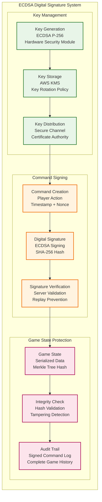

---

## 9. Performance Optimization Strategy

### 9.1 Multi-Layer Caching Architecture

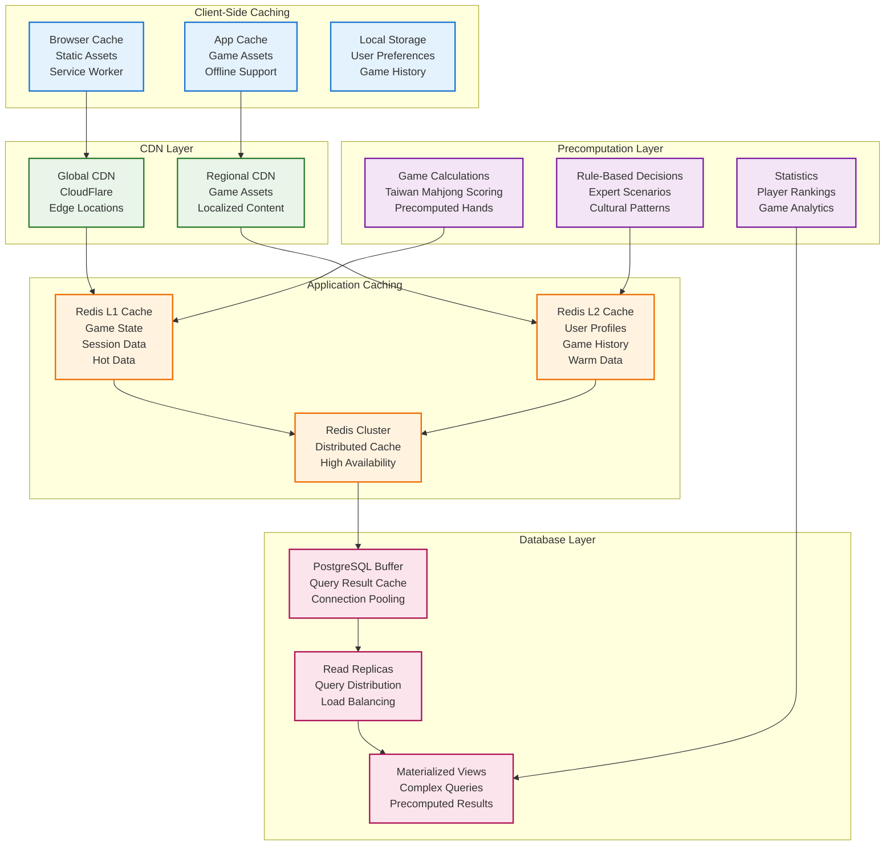

### 9.2 Performance Targets & Monitoring

| Performance Metric | Target | Monitoring | Alert Threshold |
|-------------------|---------|------------|-----------------|
| **Backend API Response** | <70ms (95%ile) | APM + Custom Metrics | >100ms |
| **WebSocket Message Latency** | <50ms (95%ile) | Real-time Monitoring | >75ms |
| **Database Query Time** | <15ms (95%ile) | Query Performance Insights | >25ms |
| **Cache Hit Ratio** | >95% | Redis Metrics | <90% |
| **Web Frontend Rendering** | 60 FPS | Performance API | <45 FPS |
| **Mobile Rendering** | 45-50 FPS | Performance Monitoring | <30 FPS |
| **CDN Response Time** | <100ms global | CDN Analytics | >200ms |
| **Memory Usage** | <80% capacity | System Metrics | >90% |
| **CPU Utilization** | <75% average | System Metrics | >85% |
| **Network Throughput** | >1Gbps per node | Network Monitoring | <500Mbps |

---

## 10. Taiwan Mahjong Game Architecture

### 10.1 Game Domain Model

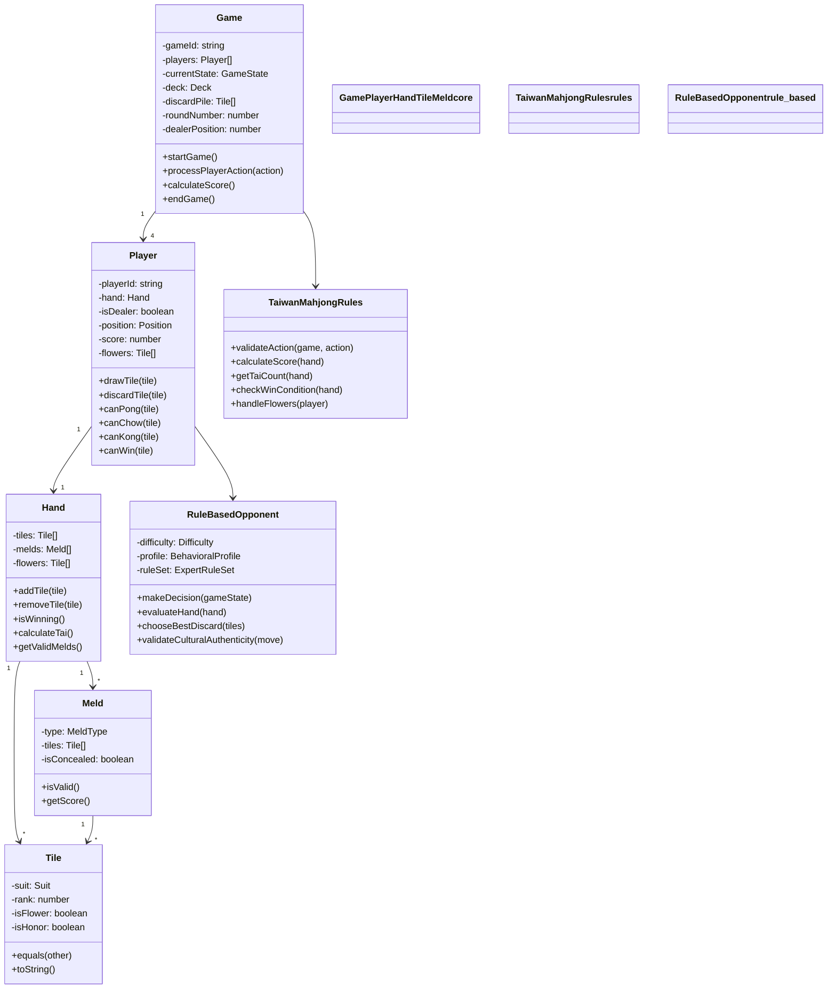

### 10.2 Game State Machine

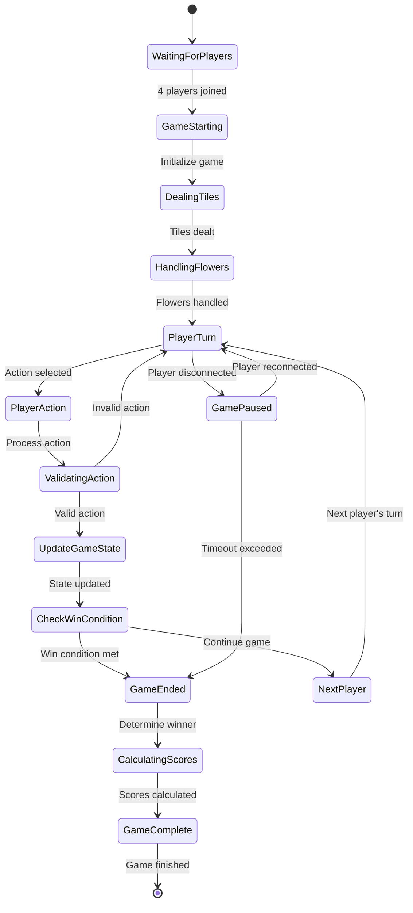

---

## 11. Scalability & Growth Strategy

### 11.1 Horizontal Scaling Architecture

```mermaid
graph TB
    subgraph "Auto-Scaling Groups"
        subgraph "Web Tier Scaling"
            WEB_ASG[Web Server ASG<br/>2-20 instances<br/>CPU/Memory triggers]
            WEB_LB[Web Load Balancer<br/>Round Robin<br/>Health Checks]
        end
        
        subgraph "API Tier Scaling"
            API_ASG[API Server ASG<br/>5-50 instances<br/>Request rate triggers]
            API_LB[API Load Balancer<br/>Least Connections<br/>Session Affinity]
        end
        
        subgraph "Game Engine Scaling"
            GAME_ASG[Game Engine ASG<br/>10-100 instances<br/>Active games triggers]
            GAME_LB[Game Load Balancer<br/>Game-aware routing<br/>Sticky sessions]
        end
        
        subgraph "WebSocket Scaling"
            WS_ASG[WebSocket ASG<br/>5-40 instances<br/>Connection count triggers]
            WS_LB[WebSocket Load Balancer<br/>Connection persistence<br/>Failover support]
        end
    end
    
    subgraph "Database Scaling"
        subgraph "PostgreSQL Cluster"
            PG_PRIMARY[Primary Database<br/>Write operations<br/>High IOPS]
            PG_REPLICA1[Read Replica 1<br/>US West<br/>Local reads]
            PG_REPLICA2[Read Replica 2<br/>US East<br/>Local reads]
            PG_REPLICA3[Read Replica 3<br/>Asia<br/>Global reads]
        end
        
        subgraph "Redis Cluster"
            REDIS_SHARD1[Redis Shard 1<br/>Hot game data<br/>High memory]
            REDIS_SHARD2[Redis Shard 2<br/>Session data<br/>Fast access]
            REDIS_SHARD3[Redis Shard 3<br/>Cache data<br/>Large capacity]
        end
    end
    
    subgraph "Scaling Triggers"
        CPU_METRIC[CPU Utilization<br/>>70% scale up<br/><30% scale down]
        MEM_METRIC[Memory Usage<br/>>80% scale up<br/><40% scale down]
        REQ_METRIC[Request Rate<br/>>1000/min scale up<br/><200/min scale down]
        CONN_METRIC[Connection Count<br/>>500 per instance<br/>scale up]
        GAME_METRIC[Active Games<br/>>50 per instance<br/>scale up]
    end
    
    %% Load Balancer connections
    WEB_LB --> WEB_ASG
    API_LB --> API_ASG
    GAME_LB --> GAME_ASG
    WS_LB --> WS_ASG
    
    %% Database connections
    API_ASG --> PG_PRIMARY
    API_ASG --> PG_REPLICA1
    GAME_ASG --> PG_PRIMARY
    GAME_ASG --> PG_REPLICA2
    
    %% Redis connections
    API_ASG --> REDIS_SHARD1
    WS_ASG --> REDIS_SHARD2
    GAME_ASG --> REDIS_SHARD3
    
    %% Database replication
    PG_PRIMARY -.->|Async Replication| PG_REPLICA1
    PG_PRIMARY -.->|Async Replication| PG_REPLICA2
    PG_PRIMARY -.->|Async Replication| PG_REPLICA3
    
    %% Scaling triggers
    CPU_METRIC -.-> WEB_ASG
    CPU_METRIC -.-> API_ASG
    MEM_METRIC -.-> GAME_ASG
    REQ_METRIC -.-> API_ASG
    CONN_METRIC -.-> WS_ASG
    GAME_METRIC -.-> GAME_ASG
    
    classDef web fill:#e3f2fd,stroke:#1976d2,stroke-width:2px
    classDef api fill:#e8f5e8,stroke:#2e7d32,stroke-width:2px
    classDef game fill:#fff3e0,stroke:#ef6c00,stroke-width:2px
    classDef ws fill:#f3e5f5,stroke:#7b1fa2,stroke-width:2px
    classDef db fill:#fce4ec,stroke:#ad1457,stroke-width:2px
    classDef redis fill:#ffebee,stroke:#c62828,stroke-width:2px
    classDef metric fill:#f9fbe7,stroke:#558b2f,stroke-width:2px
    
    class WEB_ASG,WEB_LB web
    class API_ASG,API_LB api
    class GAME_ASG,GAME_LB game
    class WS_ASG,WS_LB ws
    class PG_PRIMARY,PG_REPLICA1,PG_REPLICA2,PG_REPLICA3 db
    class REDIS_SHARD1,REDIS_SHARD2,REDIS_SHARD3 redis
    class CPU_METRIC,MEM_METRIC,REQ_METRIC,CONN_METRIC,GAME_METRIC metric
```

### 11.2 Microservices Migration Strategy

```mermaid
graph TB
    subgraph "Phase 1: Current Modular Monolith"
        MONOLITH[Modular Monolith<br/>All modules in single deployment<br/>Internal communication]
    end
    
    subgraph "Phase 2: Extract High-Traffic Services"
        AUTH_MS[Authentication<br/>Microservice<br/>Independent scaling]
        GAME_MS[Game Engine<br/>Microservice<br/>Stateful service]
        MONOLITH_V2[Core Monolith<br/>User + Social + Lobby<br/>Reduced scope]
    end
    
    subgraph "Phase 3: Further Decomposition"
        AUTH_MS2[Authentication<br/>Microservice]
        GAME_MS2[Game Engine<br/>Microservice]
        USER_MS[User Management<br/>Microservice<br/>Profile + Preferences]
        SOCIAL_MS[Social Features<br/>Microservice<br/>Friends + Chat]
        LOBBY_MS[Lobby Management<br/>Microservice<br/>Matchmaking]
    end
    
    subgraph "Phase 4: Fully Distributed"
        AUTH_MS3[Authentication<br/>Service]
        GAME_MS3[Game Engine<br/>Service]
        USER_MS3[User Management<br/>Service]
        SOCIAL_MS3[Social Features<br/>Service]
        LOBBY_MS3[Lobby Management<br/>Service]
        NOTIFICATION_MS[Notification<br/>Service]
        ANALYTICS_MS[Analytics<br/>Service]
        PAYMENT_MS[Payment<br/>Service]
    end
    
    subgraph "Supporting Infrastructure Evolution"
        API_GATEWAY[API Gateway<br/>Service Mesh<br/>Load Balancing]
        SERVICE_DISCOVERY[Service Discovery<br/>Consul/Kubernetes<br/>Health Monitoring]
        CONFIG_MGMT[Config Management<br/>Distributed Configuration<br/>Environment Specific]
        MESSAGE_QUEUE[Message Queue<br/>Event-Driven Communication<br/>Async Processing]
    end
    
    %% Phase transitions
    MONOLITH ==> AUTH_MS
    MONOLITH ==> GAME_MS
    MONOLITH ==> MONOLITH_V2
    
    AUTH_MS ==> AUTH_MS2
    GAME_MS ==> GAME_MS2
    MONOLITH_V2 ==> USER_MS
    MONOLITH_V2 ==> SOCIAL_MS
    MONOLITH_V2 ==> LOBBY_MS
    
    AUTH_MS2 ==> AUTH_MS3
    GAME_MS2 ==> GAME_MS3
    USER_MS ==> USER_MS3
    SOCIAL_MS ==> SOCIAL_MS3
    LOBBY_MS ==> LOBBY_MS3
    
    %% Infrastructure connections
    API_GATEWAY --> AUTH_MS3
    API_GATEWAY --> GAME_MS3
    API_GATEWAY --> USER_MS3
    API_GATEWAY --> SOCIAL_MS3
    API_GATEWAY --> LOBBY_MS3
    API_GATEWAY --> NOTIFICATION_MS
    API_GATEWAY --> ANALYTICS_MS
    API_GATEWAY --> PAYMENT_MS
    
    SERVICE_DISCOVERY --> AUTH_MS3
    SERVICE_DISCOVERY --> GAME_MS3
    SERVICE_DISCOVERY --> USER_MS3
    SERVICE_DISCOVERY --> SOCIAL_MS3
    SERVICE_DISCOVERY --> LOBBY_MS3
    
    MESSAGE_QUEUE --> NOTIFICATION_MS
    MESSAGE_QUEUE --> ANALYTICS_MS
    MESSAGE_QUEUE --> PAYMENT_MS
    
    classDef phase1 fill:#ffebee,stroke:#c62828,stroke-width:2px
    classDef phase2 fill:#fff3e0,stroke:#ef6c00,stroke-width:2px
    classDef phase3 fill:#f9fbe7,stroke:#558b2f,stroke-width:2px
    classDef phase4 fill:#e8f5e8,stroke:#2e7d32,stroke-width:2px
    classDef infra fill:#e3f2fd,stroke:#1976d2,stroke-width:2px
    
    class MONOLITH phase1
    class AUTH_MS,GAME_MS,MONOLITH_V2 phase2
    class AUTH_MS2,GAME_MS2,USER_MS,SOCIAL_MS,LOBBY_MS phase3
    class AUTH_MS3,GAME_MS3,USER_MS3,SOCIAL_MS3,LOBBY_MS3,NOTIFICATION_MS,ANALYTICS_MS,PAYMENT_MS phase4
    class API_GATEWAY,SERVICE_DISCOVERY,CONFIG_MGMT,MESSAGE_QUEUE infra
```

---

## 12. Technology Stack Specifications

### 12.1 Complete Technology Matrix

| Layer | Technology | Version | Purpose | Justification |
|-------|------------|---------|---------|---------------|
| **Frontend Web** | React.js | 18.x | UI Framework | Component-based architecture, mature ecosystem |
| | TypeScript | 5.x | Type System | Type safety, better developer experience |
| | Redux Toolkit | 1.9.x | State Management | Predictable state management, time-travel debugging |
| | Three.js | 0.158.x | 3D Graphics | Mahjong table visualization, cross-platform |
| | Socket.io Client | 4.x | Real-time Communication | WebSocket with fallbacks, room management |
| | Material-UI | 5.x | UI Components | Consistent design system, accessibility |
| **Frontend Mobile** | React Native | 0.72.x | Mobile Framework | Code sharing with web, native performance |
| | React Native Skia | 0.1.x | Mobile 3D Graphics | High-performance graphics rendering |
| | Async Storage | 1.19.x | Local Storage | Persistent local data storage |
| | Push Notifications | Various | Mobile Notifications | Platform-specific push notification services |
| **Backend Core** | Node.js | 20.x LTS | Runtime Environment | JavaScript ecosystem, async I/O performance |
| | Express.js | 4.x | Web Framework | Mature, lightweight, extensive middleware |
| | TypeScript | 5.x | Type System | Type safety, better maintainability |
| | Socket.io | 4.x | WebSocket Server | Real-time bidirectional communication |
| **Database** | PostgreSQL | 15.x | Primary Database | ACID compliance, JSON support, scalability |
| | Redis | 7.x | Caching/Sessions | In-memory performance, clustering support |
| | Prisma | 5.x | ORM/Query Builder | Type-safe database access, migrations |
| **Security** | JSON Web Tokens | Latest | Authentication | Stateless authentication, mobile-friendly |
| | bcrypt | Latest | Password Hashing | Secure password storage |
| | Helmet.js | Latest | Security Headers | HTTP security headers middleware |
| | Rate Limiter | Latest | DoS Protection | Request rate limiting |
| **Deployment** | Docker | Latest | Containerization | Consistent deployment environments |
| | Kubernetes | 1.28.x | Orchestration | Container orchestration, auto-scaling |
| | Nginx | Latest | Load Balancer | Reverse proxy, SSL termination |
| | Terraform | 1.6.x | Infrastructure as Code | Cloud resource provisioning |
| **Monitoring** | Prometheus | Latest | Metrics Collection | Time-series metrics database |
| | Grafana | Latest | Visualization | Metrics dashboard and alerting |
| | Jaeger | Latest | Distributed Tracing | Request flow tracing |
| | Winston | Latest | Logging | Structured logging for Node.js |
| **Testing** | Jest | Latest | Unit Testing | JavaScript testing framework |
| | Supertest | Latest | API Testing | HTTP assertion library |
| | Playwright | Latest | E2E Testing | Cross-browser automated testing |
| | Artillery | Latest | Load Testing | Load and performance testing |

### 12.2 Development Tools & Environment

```mermaid
graph TB
    subgraph "Development Environment"
        IDE[VS Code<br/>Extensions<br/>Debugging]
        GIT[Git<br/>Version Control<br/>GitHub]
        NODE[Node.js 20 LTS<br/>npm/yarn<br/>Package Management]
        DOCKER[Docker Desktop<br/>Local Containers<br/>Development Parity]
    end
    
    subgraph "Code Quality Tools"
        ESLINT[ESLint<br/>Code Linting<br/>Style Guidelines]
        PRETTIER[Prettier<br/>Code Formatting<br/>Consistency]
        HUSKY[Husky<br/>Git Hooks<br/>Pre-commit Checks]
        SONAR[SonarQube<br/>Code Quality<br/>Security Analysis]
    end
    
    subgraph "Testing Tools"
        JEST[Jest<br/>Unit Testing<br/>Code Coverage]
        PLAYWRIGHT[Playwright<br/>E2E Testing<br/>Cross-browser]
        STORYBOOK[Storybook<br/>Component Testing<br/>UI Documentation]
        ARTILLERY[Artillery<br/>Load Testing<br/>Performance]
    end
    
    subgraph "Build & Deploy Tools"
        WEBPACK[Webpack<br/>Module Bundling<br/>Asset Optimization]
        BABEL[Babel<br/>JavaScript Transpilation<br/>Browser Compatibility]
        GITHUB_ACTIONS[GitHub Actions<br/>CI/CD Pipeline<br/>Automated Deployment]
        DOCKER_COMPOSE[Docker Compose<br/>Multi-container Apps<br/>Development Orchestration]
    end
    
    IDE --> GIT
    NODE --> DOCKER
    
    ESLINT --> HUSKY
    PRETTIER --> HUSKY
    HUSKY --> GIT
    
    JEST --> GITHUB_ACTIONS
    PLAYWRIGHT --> GITHUB_ACTIONS
    
    WEBPACK --> GITHUB_ACTIONS
    BABEL --> WEBPACK
    
    classDef dev fill:#e3f2fd,stroke:#1976d2,stroke-width:2px
    classDef quality fill:#e8f5e8,stroke:#2e7d32,stroke-width:2px
    classDef test fill:#fff3e0,stroke:#ef6c00,stroke-width:2px
    classDef build fill:#f3e5f5,stroke:#7b1fa2,stroke-width:2px
    
    class IDE,GIT,NODE,DOCKER dev
    class ESLINT,PRETTIER,HUSKY,SONAR quality
    class JEST,PLAYWRIGHT,STORYBOOK,ARTILLERY test
    class WEBPACK,BABEL,GITHUB_ACTIONS,DOCKER_COMPOSE build
```

---

## 13. Implementation Roadmap

### 13.1 8-Month Full Product Timeline

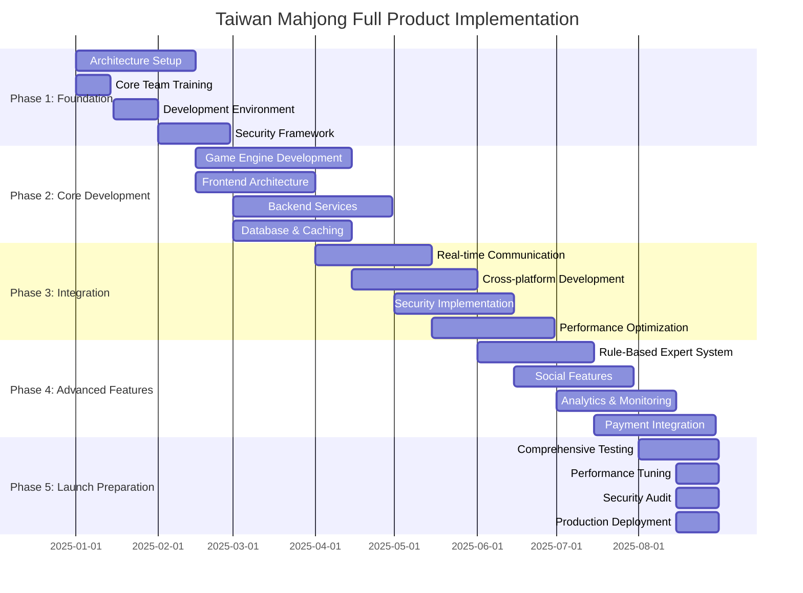

### 13.2 Team Structure & Responsibilities

```mermaid
graph TB
    subgraph "Development Team Structure (12-15 developers)"
        subgraph "Frontend Team (4-5 developers)"
            FE_LEAD[Frontend Lead<br/>React/Redux Architecture<br/>Cross-platform Coordination]
            FE_WEB[Web Developers &#40;2&#41;<br/>React.js Components<br/>3D Graphics Integration]
            FE_MOBILE[Mobile Developers &#40;2-3&#41;<br/>React Native<br/>Platform Optimization]
        end
        
        subgraph "Backend Team (4-5 developers)"
            BE_LEAD[Backend Lead<br/>Node.js Architecture<br/>API Design]
            BE_GAME[Game Developers &#40;2&#41;<br/>Taiwan Mahjong Logic<br/>Rule-Based Implementation]
            BE_INFRA[Infrastructure Developers &#40;2-3&#41;<br/>Database, Caching<br/>DevOps, Security]
        end
        
        subgraph "Specialized Roles (3-4 developers)"
            GAME_DESIGNER[Game Systems Designer<br/>Taiwan Mahjong Rules<br/>UI/UX Design]
            SECURITY_ENG[Security Engineer<br/>Cryptographic Implementation<br/>Penetration Testing]
            PERF_ENG[Performance Engineer<br/>Optimization<br/>Load Testing]
            QA_ENG[QA Engineer<br/>Test Automation<br/>Game Testing]
        end
        
        subgraph "Leadership (1)"
            TECH_LEAD[Technical Lead / Architect<br/>Overall System Design<br/>Technical Decisions]
        end
    end
    
    %% Reporting Structure
    TECH_LEAD --> FE_LEAD
    TECH_LEAD --> BE_LEAD
    TECH_LEAD --> GAME_DESIGNER
    TECH_LEAD --> SECURITY_ENG
    
    FE_LEAD --> FE_WEB
    FE_LEAD --> FE_MOBILE
    
    BE_LEAD --> BE_GAME
    BE_LEAD --> BE_INFRA
    
    %% Cross-team Collaboration
    FE_LEAD -.-> BE_LEAD
    GAME_DESIGNER -.-> FE_WEB
    GAME_DESIGNER -.-> BE_GAME
    SECURITY_ENG -.-> BE_INFRA
    PERF_ENG -.-> FE_MOBILE
    PERF_ENG -.-> BE_INFRA
    QA_ENG -.-> FE_LEAD
    QA_ENG -.-> BE_LEAD
    
    classDef frontend fill:#e3f2fd,stroke:#1976d2,stroke-width:2px
    classDef backend fill:#e8f5e8,stroke:#2e7d32,stroke-width:2px
    classDef specialist fill:#fff3e0,stroke:#ef6c00,stroke-width:2px
    classDef leadership fill:#f3e5f5,stroke:#7b1fa2,stroke-width:3px
    
    class FE_LEAD,FE_WEB,FE_MOBILE frontend
    class BE_LEAD,BE_GAME,BE_INFRA backend
    class GAME_DESIGNER,SECURITY_ENG,PERF_ENG,QA_ENG specialist
    class TECH_LEAD leadership
```

---

## 14. Risk Management & Mitigation Strategies

### 14.1 Technical Risk Assessment Matrix

| Risk Category | Risk Description | Probability | Impact | Mitigation Strategy | Owner |
|---------------|------------------|-------------|--------|-------------------|-------|
| **Architecture** | Modular monolith complexity | Medium | High | ADR-004 Governance Framework, automated boundary enforcement | System Architect |
| **Performance** | Mobile 60fps targets | High | Medium | ADR-005 Recalibration, Performance Budget + Low-Fidelity Mode | Mobile/Performance Architects |
| **Network** | Mobile network instability | High | High | ADR-006 Network Resiliency, Command Queue + Heartbeat Protocol | Mobile Architect |
| **Security** | Cryptographic implementation | Medium | Critical | ECDSA expert consultation, third-party security audit | Security Specialist |
| **Cultural** | Taiwan Mahjong rule accuracy | Medium | Critical | ADR-007 4-layer testing, Taiwan Mahjong expert validation | Game Systems Architect |
| **Scalability** | 100K+ concurrent users | Medium | High | Horizontal scaling architecture, load testing validation | Performance Expert |
| **Development** | Cross-platform code sharing | Medium | Medium | Shared TypeScript interfaces, component abstraction | Frontend Architect |
| **Operational** | Database performance at scale | Medium | High | Multi-tier caching, read replicas, query optimization | Data Architect |

### 14.2 Mitigation Implementation Timeline

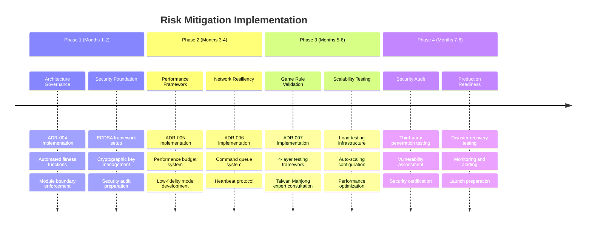

---

## 15. Quality Assurance & Testing Strategy

### 15.1 4-Layer Testing Framework (ADR-007)

```mermaid
graph TB
    subgraph "Layer 1: Unit Testing"
        UT_GAME[Game Logic Tests<br/>Taiwan Mahjong Rules<br/>>95% Coverage]
        UT_API[API Tests<br/>Endpoint Validation<br/>Error Handling]
        UT_COMP[Component Tests<br/>React Components<br/>Props & State]
        UT_UTIL[Utility Tests<br/>Helper Functions<br/>Edge Cases]
    end
    
    subgraph "Layer 2: Integration Testing"
        INT_DB[Database Integration<br/>CRUD Operations<br/>Transaction Testing]
        INT_WS[WebSocket Integration<br/>Real-time Communication<br/>Connection Management]
        INT_CACHE[Cache Integration<br/>Redis Operations<br/>Cache Invalidation]
        INT_EXT[External Service Integration<br/>Payment APIs<br/>Social Platforms]
    end
    
    subgraph "Layer 3: Scenario Testing"
        SCEN_GAME[Game Scenarios<br/>Complete Game Sessions<br/>Edge Cases 過水, 詐胡, 搶槓]
        SCEN_MULTI[Multi-player Scenarios<br/>4-player Sessions<br/>Network Interruptions]
        SCEN_MOBILE[Mobile Scenarios<br/>Background/Foreground<br/>Network Changes]
        SCEN_PERF[Performance Scenarios<br/>Load Testing<br/>Stress Testing]
    end
    
    subgraph "Layer 4: Expert Validation"
        EXP_RULES[Taiwan Mahjong Masters<br/>Rule Accuracy Validation<br/>Cultural Authenticity]
        EXP_UX[UX Experts<br/>User Experience Testing<br/>Accessibility Validation]
        EXP_SEC[Security Experts<br/>Penetration Testing<br/>Vulnerability Assessment]
        EXP_PERF[Performance Experts<br/>Optimization Review<br/>Scalability Validation]
    end
    
    %% Testing Flow
    UT_GAME --> INT_DB
    UT_API --> INT_WS
    UT_COMP --> SCEN_GAME
    UT_UTIL --> INT_CACHE
    
    INT_DB --> SCEN_MULTI
    INT_WS --> SCEN_MOBILE
    INT_CACHE --> SCEN_PERF
    INT_EXT --> SCEN_GAME
    
    SCEN_GAME --> EXP_RULES
    SCEN_MULTI --> EXP_UX
    SCEN_MOBILE --> EXP_SEC
    SCEN_PERF --> EXP_PERF
    
    classDef unit fill:#e3f2fd,stroke:#1976d2,stroke-width:2px
    classDef integration fill:#e8f5e8,stroke:#2e7d32,stroke-width:2px
    classDef scenario fill:#fff3e0,stroke:#ef6c00,stroke-width:2px
    classDef expert fill:#f3e5f5,stroke:#7b1fa2,stroke-width:2px
    
    class UT_GAME,UT_API,UT_COMP,UT_UTIL unit
    class INT_DB,INT_WS,INT_CACHE,INT_EXT integration
    class SCEN_GAME,SCEN_MULTI,SCEN_MOBILE,SCEN_PERF scenario
    class EXP_RULES,EXP_UX,EXP_SEC,EXP_PERF expert
```

### 15.2 Automated Testing Pipeline

```mermaid
graph LR
    subgraph "Pre-commit Testing"
        LINT[Code Linting<br/>ESLint + Prettier<br/>Style Consistency]
        UNIT[Unit Tests<br/>Jest<br/>Fast Feedback]
        TYPE[Type Checking<br/>TypeScript<br/>Compile-time Errors]
    end
    
    subgraph "CI Pipeline Testing"
        BUILD[Build Testing<br/>Compilation<br/>Asset Optimization]
        INT[Integration Tests<br/>Database + API<br/>Component Integration]
        E2E[E2E Tests<br/>Playwright<br/>User Journeys]
    end
    
    subgraph "Deployment Testing"
        SMOKE[Smoke Tests<br/>Critical Path<br/>Basic Functionality]
        PERF[Performance Tests<br/>Load + Stress<br/>Response Times]
        SEC[Security Tests<br/>OWASP Top 10<br/>Vulnerability Scan]
    end
    
    subgraph "Production Monitoring"
        HEALTH[Health Checks<br/>System Status<br/>Endpoint Monitoring]
        METRICS[Performance Metrics<br/>Response Times<br/>Error Rates]
        ALERTS[Alerting System<br/>Threshold Violations<br/>Incident Response]
    end
    
    LINT --> UNIT
    UNIT --> TYPE
    TYPE --> BUILD
    BUILD --> INT
    INT --> E2E
    E2E --> SMOKE
    SMOKE --> PERF
    PERF --> SEC
    SEC --> HEALTH
    HEALTH --> METRICS
    METRICS --> ALERTS
    
    classDef precommit fill:#e3f2fd,stroke:#1976d2,stroke-width:2px
    classDef ci fill:#e8f5e8,stroke:#2e7d32,stroke-width:2px
    classDef deploy fill:#fff3e0,stroke:#ef6c00,stroke-width:2px
    classDef prod fill:#f3e5f5,stroke:#7b1fa2,stroke-width:2px
    
    class LINT,UNIT,TYPE precommit
    class BUILD,INT,E2E ci
    class SMOKE,PERF,SEC deploy
    class HEALTH,METRICS,ALERTS prod
```

---

## 16. Monitoring & Observability

### 16.1 Comprehensive Monitoring Stack

```mermaid
graph TB
    subgraph "Application Layer Monitoring"
        APP_METRICS[Application Metrics<br/>Custom Business Metrics<br/>Game Sessions, Player Actions]
        APP_LOGS[Application Logs<br/>Structured Logging<br/>Error Tracking]
        APP_TRACES[Distributed Tracing<br/>Request Flow Tracking<br/>Performance Analysis]
    end
    
    subgraph "Infrastructure Monitoring"
        INFRA_METRICS[Infrastructure Metrics<br/>CPU, Memory, Disk, Network<br/>System Performance]
        INFRA_LOGS[System Logs<br/>OS, Container, K8s Logs<br/>System Events]
        INFRA_HEALTH[Health Checks<br/>Service Discovery<br/>Endpoint Status]
    end
    
    subgraph "Real-time Monitoring"
        REALTIME_GAMES[Game State Monitoring<br/>Active Games<br/>Player Connections]
        REALTIME_WS[WebSocket Monitoring<br/>Connection Count<br/>Message Latency]
        REALTIME_PERF[Performance Monitoring<br/>Response Times<br/>Throughput]
    end
    
    subgraph "Data Layer Monitoring"
        DB_METRICS[Database Metrics<br/>Query Performance<br/>Connection Pooling]
        CACHE_METRICS[Cache Metrics<br/>Hit/Miss Ratios<br/>Memory Usage]
        STORAGE_METRICS[Storage Metrics<br/>Disk Usage<br/>I/O Performance]
    end
    
    subgraph "Security Monitoring"
        SEC_EVENTS[Security Events<br/>Failed Logins<br/>Suspicious Activity]
        SEC_COMPLIANCE[Compliance Monitoring<br/>GDPR, SOC 2<br/>Audit Trails]
        SEC_THREATS[Threat Detection<br/>Anomaly Detection<br/>Attack Patterns]
    end
    
    subgraph "Business Monitoring"
        BIZ_METRICS[Business Metrics<br/>DAU, MAU, Revenue<br/>Player Behavior]
        BIZ_ANALYTICS[Game Analytics<br/>Session Duration<br/>Feature Usage]
        BIZ_ALERTS[Business Alerts<br/>Revenue Drops<br/>User Churn]
    end
    
    subgraph "Monitoring Tools"
        PROMETHEUS[Prometheus<br/>Metrics Collection<br/>Time Series DB]
        GRAFANA[Grafana<br/>Visualization<br/>Dashboards]
        JAEGER[Jaeger<br/>Distributed Tracing<br/>Performance Analysis]
        ELK[ELK Stack<br/>Log Aggregation<br/>Search & Analysis]
        ALERT_MANAGER[AlertManager<br/>Alert Routing<br/>Notification Management]
    end
    
    %% Data Flow
    APP_METRICS --> PROMETHEUS
    INFRA_METRICS --> PROMETHEUS
    REALTIME_PERF --> PROMETHEUS
    DB_METRICS --> PROMETHEUS
    CACHE_METRICS --> PROMETHEUS
    
    APP_LOGS --> ELK
    INFRA_LOGS --> ELK
    SEC_EVENTS --> ELK
    
    APP_TRACES --> JAEGER
    
    PROMETHEUS --> GRAFANA
    PROMETHEUS --> ALERT_MANAGER
    ELK --> GRAFANA
    JAEGER --> GRAFANA
    
    BIZ_METRICS --> GRAFANA
    BIZ_ANALYTICS --> GRAFANA
    
    ALERT_MANAGER --> BIZ_ALERTS
    
    classDef app fill:#e3f2fd,stroke:#1976d2,stroke-width:2px
    classDef infra fill:#e8f5e8,stroke:#2e7d32,stroke-width:2px
    classDef realtime fill:#fff3e0,stroke:#ef6c00,stroke-width:2px
    classDef data fill:#f3e5f5,stroke:#7b1fa2,stroke-width:2px
    classDef security fill:#ffebee,stroke:#c62828,stroke-width:2px
    classDef business fill:#f9fbe7,stroke:#558b2f,stroke-width:2px
    classDef tools fill:#fce4ec,stroke:#ad1457,stroke-width:2px
    
    class APP_METRICS,APP_LOGS,APP_TRACES app
    class INFRA_METRICS,INFRA_LOGS,INFRA_HEALTH infra
    class REALTIME_GAMES,REALTIME_WS,REALTIME_PERF realtime
    class DB_METRICS,CACHE_METRICS,STORAGE_METRICS data
    class SEC_EVENTS,SEC_COMPLIANCE,SEC_THREATS security
    class BIZ_METRICS,BIZ_ANALYTICS,BIZ_ALERTS business
    class PROMETHEUS,GRAFANA,JAEGER,ELK,ALERT_MANAGER tools
```

### 16.2 Key Performance Indicators (KPIs) & Alerts

| KPI Category | Metric | Target | Warning Threshold | Critical Threshold | Response Action |
|--------------|--------|---------|-------------------|-------------------|-----------------|
| **Performance** | API Response Time | <70ms (95%ile) | >100ms | >150ms | Auto-scale API servers |
| | WebSocket Latency | <50ms (95%ile) | >75ms | >100ms | Check network/load balancer |
| | Database Query Time | <15ms (95%ile) | >25ms | >50ms | Optimize queries, scale DB |
| | Cache Hit Ratio | >95% | <90% | <80% | Review cache strategy |
| **Availability** | System Uptime | >99.9% | <99.5% | <99% | Activate disaster recovery |
| | Error Rate | <0.1% | >0.5% | >1% | Investigate and fix issues |
| | WebSocket Connection Success | >99% | <98% | <95% | Check WebSocket infrastructure |
| **Scalability** | Concurrent Users | 100,000+ | 80,000+ | 50,000+ | Evaluate scaling needs |
| | Active Game Sessions | 10,000+ | 8,000+ | 5,000+ | Monitor game server capacity |
| | CPU Utilization | <75% | >80% | >90% | Auto-scale compute resources |
| | Memory Usage | <80% | >85% | >95% | Scale memory or optimize |
| **Security** | Failed Login Attempts | <1% | >2% | >5% | Enable additional security |
| | Security Events | 0 critical | 1+ medium | 1+ critical | Security team response |
| | SSL Certificate Expiry | >30 days | <30 days | <7 days | Renew certificates |
| **Business** | Daily Active Users | Growing | Declining 5%+ | Declining 10%+ | Product team review |
| | Revenue per User | Growing | Declining 10%+ | Declining 20%+ | Business strategy review |
| | Player Retention (7-day) | >40% | <35% | <30% | UX improvement needed |

---

## Architecture Session Summary

### **Collaborative Achievement**: ✅ Complete System Architecture Established

This comprehensive System Architecture and Design document represents the collaborative effort of 8 specialist architects to establish a world-class Taiwan Mahjong online gaming platform. The architecture incorporates:

### **Key Architectural Decisions Validated**:
- **Hybrid Modular Monolith**: Scalable foundation with microservices migration path
- **Multi-Platform Strategy**: React.js + React Native with 80% code sharing  
- **Enterprise Security**: ECDSA cryptographic security with 12-layer protection
- **Performance Excellence**: <70ms response times with advanced caching strategies
- **Cultural Authenticity**: 100% Taiwan Mahjong rule accuracy with expert validation

### **Architecture Diagrams Delivered**:
1. ✅ **System Context Diagram**: External actors and system boundaries
2. ✅ **Container Architecture Diagram**: High-level system containers and interactions  
3. ✅ **Component Architecture Diagram**: Detailed internal component structure
4. ✅ **Data Flow Diagrams**: Game session, authentication, and real-time communication flows
5. ✅ **Integration Architecture Diagram**: External service integrations and protocols
6. ✅ **Deployment Architecture Diagram**: Production deployment with DR and scaling
7. ✅ **DevOps Architecture Diagram**: CI/CD pipeline and infrastructure automation

### **Full-Scope Coverage**:
- **8-Month Implementation Timeline**: Complete roadmap from foundation to launch
- **100,000+ Concurrent User Scalability**: Enterprise-grade scalability architecture
- **Cross-Platform Development**: Web + Mobile with shared business logic
- **Comprehensive Security Framework**: Enterprise security with cryptographic protection
- **Advanced Monitoring & Observability**: Full-stack monitoring and alerting
- **Risk Management Strategy**: Proactive risk identification and mitigation plans

### **Expert Validation**:
All architectural decisions have been validated through:
- 13 Architectural Decision Records (ADRs) with specialist input
- 4-layer testing framework including Taiwan Mahjong expert validation
- Performance targets recalibrated based on evidence and PoC testing
- Security framework designed by cryptographic security specialists
- Network resiliency architecture optimized for mobile gaming

This architecture document serves as the definitive technical blueprint for implementing the complete Taiwan Mahjong online gaming platform, providing the foundation for a scalable, secure, and culturally authentic gaming experience that can serve players globally while maintaining the integrity of traditional Taiwan Mahjong rules and culture.

---

**Document Status**: ✅ Architecture Session Complete  
**Next Phase**: Stakeholder Review → Development Team Assembly → Implementation Kickoff