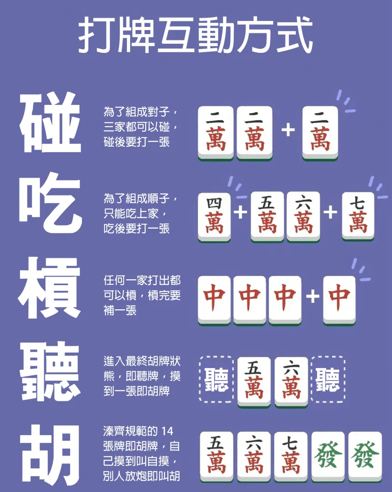

Below is a Markdown-formatted version of the content from the page "台灣16張麻將玩法指南" on 金順賽事分析:

# 台灣16張麻將玩法指南

麻將是一種源於中國的傳統遊戲，至今在亞洲各地乃至全球廣受歡迎。麻將的玩法多種多樣，每個地區有不同的變體，其中台灣的16張麻將是最具代表性的版本之一。本文將詳細介紹台灣16張麻將的基本規則、開局準備和牌局進行過程，讓新手玩家也能快速上手。

## 麻將牌組及遊戲開始

### 麻將牌介紹

- 台灣16張麻將使用144張牌，分為基本牌和花牌。
  - 基本牌有萬子、條子（索子）、筒子，各從1到9，每種牌有四張。
  - 風牌（東、南、西、北，各四張）。
  - 箭牌（中、發、白，各四張）。
  - 花牌包括春、夏、秋、冬與梅、蘭、竹、菊，各兩張。

## 座位決定

- 四名玩家隨意坐下，抽取東、南、西、北四張風牌並擲骰決定順序。
  - 擲到5、9、13、17點，由擲骰者自己抽牌。
  - 擲到6、10、14、18點，由右手邊的玩家抽牌。
  - 擲到3、7、11、15點，由對家的玩家抽牌。
  - 擲到4、8、12、16點，由左手邊的玩家抽牌。
- 座位順序按照抽到的風位逆時針入座，確定座位後立即開始洗牌與堆牌。

## 洗牌與堆牌

- 144張牌翻面洗勻，每人在自己面前疊成2×18的牌牆。
- 四面牌牆組合成一個方形，稱為“方城之戰”。  

## 拿牌與補花

- 完成牌牆後，由東風位（莊家）擲骰決定從哪一面牌牆開始拿牌。
  - 擲到5、9、13、17點，從莊家面前開始。
  - 擲到6、10、14、18點，從右手邊開始。
  - 擲到3、7、11、15點，從對家開始。
  - 擲到4、8、12、16點，從左手邊開始。
- 每位玩家逆時針方向每次取四張牌，直到每人16張牌為止。莊家多拿一張，稱“開門”。
- 如手中有花牌（梅、蘭、竹、菊；春、夏、秋、冬），需將其放在桌面上並“補花”至手牌16張；補花完喊“過補”由下家進行。

## 麻將基本規則

### 牌型組成與胡牌

- 目標：組成五組順子（123 等）、刻子（111 等）或槓（四張一組），再加上一對將（如11）。
- 手牌組合符合胡牌條件時可胡牌。

### 吃牌、碰牌、槓牌

- **吃牌**：當上家打出一張牌且您能將其與手中的兩張牌組成連續三張，如上家打出五條、您手中有四條和六條，即可吃牌。
- **碰牌**：當任一玩家打出一張牌且您手中有兩張一樣的牌，如他人打出一個九筒且您手中有兩個九筒，即可碰牌。
- **槓牌**：有三張同樣的牌時，如再有第四張，不論來源可槓，分明槓、暗槓，並補牌。暗槓自摸可多加台數。  

*Converted from: https://www.jinsun888.com/%E5%8F%B0%E7%81%A316%E5%BC%B5%E9%BA%BB%E5%B0%87%E7%8E%A9%E6%B3%95%E6%8C%87%E5%8D%97/*

[1] https://www.jinsun888.com/%E5%8F%B0%E7%81%A316%E5%BC%B5%E9%BA%BB%E5%B0%87%E7%8E%A9%E6%B3%95%E6%8C%87%E5%8D%97/
[2] https://www.mjonline.com.tw/intro/intro5.html
[3] https://vocus.cc/article/62d2988dfd897800019d7c2c
[4] https://www.klook.com/zh-TW/blog/taiwan-mahjong-rules/
[5] https://ezmjtw.tripod.com/mahjong16-big5.htm
[6] http://chiuinan.github.io/game/game/intro/ch/c42/twmj.htm
[7] https://treyotaiwan.com.tw/post/mahjong-rules
[8] http://atawmj.org.tw/mjking.htm
[9] https://mahjongtw.com/mahjong-72-concepts/
[10] http://chiuinan.github.io/game/game/intro/ch/c42/twmj3.htm
[11] https://www.gametower.com.tw/Games/Freeplay/MJ/Star31/Data/i_ingame-count.aspx