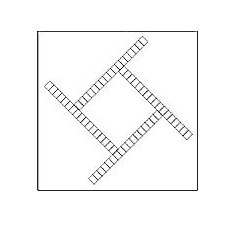
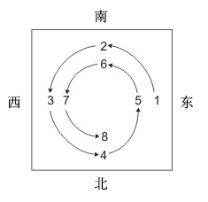
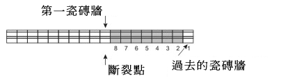

# 台灣話麻將則度 (Taiwanese Mahjong Rules)

## 1. 麻將牌

以下為現代臺灣麻將規則，其最主要的特點是和牌時要多一組牌。因此，配牌時每個玩家有16張牌，而不是13張（莊家多摸一張牌開門）。和牌時必須有5組順子/刻子/杠以及一對將牌。

還有和其他中國麻將版本所不同的地方在於牌尾有16張牌，而不是14張。

在牌型組合的選擇方面，臺灣麻將仍選用很經典的牌型，雖然由於多了一組牌而增加或刪除了某些牌型。（例如，在16張牌麻將中不能有**九蓮寶燈**和**十三么**；在另一方面，可以有**五暗刻**這樣的牌型）

在臺灣麻將中，通常不使用預先設定好的表格來確定最後的得分。相反，得分是牌型簡單相加所得。支付方案很特別：如果贏家自摸和牌，其他人都根據其最後得分支付給贏家，如果是有人放銃和牌，放銃者一人根據贏家的最後得分支付（只為自己付，而不需要為其他人付）。正如亞洲麻將的所有現代版本中，通常只有贏家會獲得支付。... 菲律賓也玩16張牌的麻將，通常使用更為傳統的規則，採用一種得分加倍的計分系統，莊家贏或者輸都要翻倍，而輸家根據其最後得分的不同給對方支付。

---

### 1.1 序數牌

有3種花色：條子，萬子和筒子。每種花色有36張牌：4張1，4張2，等等，一直到9。因此序數牌共有108張。

1. **條子**（又叫索子）
2. **萬子**（又叫餅子)
3. **筒子**

從2到8的花色牌叫做中张（或者小牌，么九牌和字牌有時候叫做大牌），1和9叫做幺九牌。由么九牌組成的牌型通常比中張組成的牌型要大。

### 1.2 字牌

字牌包括三元牌和风牌。

- 三元牌有三種，每種四張：發財，紅中和白板。
- 四種風牌為：東，南，西，北。

字牌共有28張。

三元牌上面的中文字分別是“發”（意思是發財，代表地），“中”（意思是中心，代表人），“白板”（意思是白色空白）。

### 1.3 花牌和四季牌

除基本牌之外，有四張花牌和四張四季牌通常用作獎勵牌（有些玩家只用花牌）。花牌和四季牌不能用在牌型組合中：拿到花牌後，必須馬上亮明，然後放在旁邊，補一張牌。每張獎勵牌和一個風向對應，如下：

- 花牌：
  - 梅（東）
  - 蘭（南）
  - 菊（西）
  - 竹（北）

- 四季牌：
  - 春（東）
  - 夏（南）
  - 秋（西）
  - 冬（北）

### 1.4 牌識別字

當麻將遊戲傳入美國時，牌上增加了數位和字母，這樣更容易識別。在亞洲麻將牌中識別字通常只用在獎勵牌上。

---

## 2. 遊戲準備 (Game Preparation)

一局完整的麻將一般有16盤，如果莊家和牌或者荒牌，會連莊，盤數會增加。每一盤從砌牌開始，然後開牌，配牌。

遊戲開始前，玩家擲幾次骰子來確定座位順序、莊家（東家）以及在牌墙的哪個位置開門。

### 2.1 確定座位和莊家

剛開始4個玩家隨意就座。任何一個玩家擲兩個骰子，從他自己開始，按照逆時針方向從1數到骰子擲出的數字。數到的玩家成為“臨時莊家”，其他3個位置，按照逆時針順序，分別為臨時南家，西家和北家。

接下來任何一個玩家混合4張風牌，每種風向一張，面朝下放在桌子上，並堆成一堆。

臨時莊家擲骰，從他自己開始逆時針數。數到的玩家拿最頂上的風牌。其他3個玩家按照逆時針方向，依次從牌堆上拿一張牌。每個玩家坐在自己摸到的牌指示的位置，這樣第一階段座位就分配好了。（詳情參見圖1）。

現在成為臨時莊家的玩家擲骰並從自己開始按照逆時針方向數。數到的玩家成為最終的莊家，其他玩家按照逆時針方向分配位置。

**注意：**  
在遊戲準備的規則方面，有很多重要的變種。有些玩家只是隨意把4張風牌堆起來，然後擲骰決定誰拿最上面的一張，其他人按照逆時針順序依次拿一張。拿到東風的玩家位置不動，拿到南風的玩家坐在他的對面，等等。

在遊戲結束前玩家保持他們的相對位置不動（由於風向會旋轉，不是保持其指定的座位）。

---

## 3. 發牌和牌牆 (Dealing and the Wall)

每一盤遊戲開始前，都要把牌面朝下放在桌子上，由閑家充分洗牌，直到莊家說“乓”（意思是“開始”），之後每個玩家拿34張牌在自己面前砌成一行，兩張牌摞在一起為一墩，碼成17墩（如果有花牌和四季牌，就拿36張牌碼成18墩；如果只有花牌，東家和西家碼18墩，南家和北家碼17墩）。然後，每個玩家都把牌推到前面組成一個空心的正方形。這叫做牌牆。

要決定牌牆的開牌點，莊家擲骰然後沿著牌牆逆時針方向數，從1開始（因此，數字5和9表示東，2，6和10表示南，3，7，11為西，4，8，12為北），從右端開始。例如，他擲出了6，就從南家的牌牆右端開始數6墩牌。

注意：某些玩家使用這樣的規則：第一個開牌的莊家不再擲骰來決定開牌點，而是根據最後一次擲骰數在他自己的牌牆開牌（例如，在上文的例子中，擲出的是4）。

莊家在開牌點輕輕地把牌推向左邊來開牌。

開牌點右邊的8墩牌叫做牌尾（也叫杠頭），剩下的其他的牌，從開牌點的左邊開始，叫做活牆。牌尾的16張牌用來開杠補花（如果使用花牌和四季牌的話，補花也在牌尾補）。補牌後，從抓牌的牌牆尾部保留新的牌用來補充牌尾（但是，補牌總是從牌尾左邊抓牌）。

從莊家開始，從開牌點左邊抓 2墩牌 （也就是 4 張），然後其他 3 位玩家按照南家，西家，北家的順序每人抓2墩牌。重複抓3次到每人各有16張牌。莊家再多抓一張牌。這樣莊家共有17張牌，其他人各有16張牌。

牌局開始時，每個玩家先整理自己發到的牌，對手不能看到這些牌，但可以數牌。

如果使用花牌和四季牌，發牌時就包括了花牌和四季牌，拿到這些牌後，必須立刻攤出（面朝上放在旁邊），並從牌尾補花（先由莊家補花，然後是南家，西家和北家）。如果補花的過程中又摸到花牌，必須等到其他玩家首輪補花完畢後才能再補。

### 砌牌和開牌
- a. 四邊的牌牆推到一起，在桌子中間形成一個包圍的空間  
  
- b. 莊家擲骰 – 這裏擲出的是8-然後按逆時針方向沿著牌牆數。  

- c. 然後莊家從B階段確定的玩家（這裏是北家）的牌牆上從右端開始數出8墩牌（根據最後一次擲骰的數字來定），然後開牌。開牌點右邊的16張牌（圖中的灰色部分）作為牌尾。  
  
- d. 按照東，南，西，北的順序，從活牆開始處每個玩家每次抓2墩牌（也就是每次4張牌），直至每個玩家有16張牌。然後莊家再抓一張牌，手中有17張牌。

## 4. 牌組合與特殊牌型 (Tile Combinations and Special Hands)

玩家可以用自己從牌牆摸到的牌組成這些組合，也可能吃或者碰其他玩家打出的牌。從牌牆摸到的牌組成的組合叫做**暗牌**，吃或者碰其他玩家的牌叫做**明牌**。

如果遊戲中用到了獎勵牌（花牌和四季牌），這些牌不能用在牌組合中，摸到花牌和四季牌時，必須立刻從牌尾補牌。

除了常規的包含5組牌和一個對子的和牌牌型外，一般來說規則還允許至少一種不規則的牌型：**七個對子加上一組刻子**。

---

## 5. 遊戲的常規步驟與雜項規則 (Routine Steps and Miscellaneous Rules)

### 5.1 遊戲的常規步驟

遊戲按照逆時針方向進行，玩家依次按照東、南、西、北的順序從牌牆摸牌並出牌。

東家（莊家）在發牌結束時擁有17張牌，開始出牌。如果東家摸到花牌，必須在發牌結束後立刻補花（詳情請參見“遊戲準備”部分）。若東家沒有和牌，則需打出一張牌。

習慣上（不是強制性規定）玩家出牌時會說出牌的名稱。

打出的牌面朝上放在桌中間（牌牆內），但擺放位置隨意，這樣其他玩家無法辨別哪張牌是誰打出的，也看不出出牌順序。

---

### 5.2 雜項規則 (Optional Rules)

#### 5.2.1 過水

在臺灣麻將中，通常使用這樣的規則：若玩家在某一輪中有和牌機會但未和，該輪內便不能再以該牌和牌。玩家必須先打出一張牌，才能再次使用該錯過的牌和牌。該規則同樣適用於自摸的情況。在日本麻將中也有類似規則，但自摸不受限制。

例如，玩家A需要一張3條和牌，玩家B打出3條，A未宣布和牌，若該輪內玩家C或D再打出3條，或A自己摸到3條，都不能用3條和牌。玩家A必須先打出一張牌，才能用3條和牌。

玩家可吃或碰該錯過的牌，但不能用來和牌。

#### 5.2.2 莊家的獎勵

臺灣麻將規定若莊家和牌，通常會額外多獲得一台獎勵。

若莊家自摸和牌，所有輸家需多支付額外台數；若不是自摸，則由放銃者單獨多支付額外台數（只需為自己支付，不用替其他輸家支付）。若莊家放銃，也需多付給贏家額外台數。

#### 5.2.3 連莊獎勵

在臺灣麻將中，同一玩家連續坐莊（連莊）且和牌時，通常會額外獲得獎勵。

獎勵累積增加：第一次連莊和牌獎勵2台，第二次獎勵4台，依此類推（6台等）。

若莊家自摸，所有輸家支付獎勵；若他人和牌，則只有放銃者支付，這點不同於日本麻將(日本麻將要求所有輸家支付)。

若莊家放銃，須多支付獎勵給贏家；若多贏家，須給每位贏家。

荒局時莊家通常會續莊，連莊不一定是莊家上一盤和牌，玩家須商定荒局是否計算於連莊盤數。

#### 5.2.4 處罰規則

不同行牌規則導致處罰方式不同。友好遊戲中，對不影響他人的輕微犯規可不處罰，玩家應在遊戲前協議處罰細則。

常見規則包括：

- 若玩家手牌過多且已看到多餘牌面，必須保持大相公，該盤不能和牌。
- 若手牌太少，必須保持小相公，該盤不能和牌。
- 摸錯牌但未出牌，可替換正確牌；若已出牌，不能替換但可繼續遊戲無罰。
- 出牌後當輪若其他玩家均未和該牌，且下一家尚未摸牌，可更換出牌。
- 取消和牌宣告不罰，若無玩家和該牌或下一家未摸牌。
- 取消報吃、碰、杠不罰，條件同上。
- 若詐和且錯誤在其他玩家攤牌前發覺，不罰；若已攤牌，該盤作廢，違規者須向其他三家各賠付滿貫（16分）。
- 詐和牌若為他人胡牌的牌，該玩家要支付雙倍。
- 詐和通常須換莊。

#### 5.2.5 保護性處罰（防「放水」）

玩家普遍同意對不負責任出牌（放水）處罰，尤其是可能讓他人和大牌的危險牌出牌。

通常適用於以下牌型時：

- 清一色：若玩家A已亮4組同花色牌，另玩家出同色單牌輕易助和，則處罰。
- 大四喜／小四喜：已亮3組風牌者，若另玩家出第4組風牌助和，則處罰。
- 大三元／小三元：已亮2組三元牌者，另玩家出第3組助和，處罰。
- 牌牆剩最後5張牌時，新出牌導致和牌，也會受保護性處罰。
- 同理對字一色、清么九等大牌型也適用保護性處罰。

放水玩家須賠償所有輸家（不僅只賠自己份），且輸家間不再結算。

搶杠所搶的牌若危險，也視同放水牌受罰。打出危險牌被報杠則不受此罰。

---

*版權 2025 Mahjong Time 保留所有權利*
