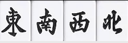
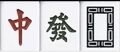
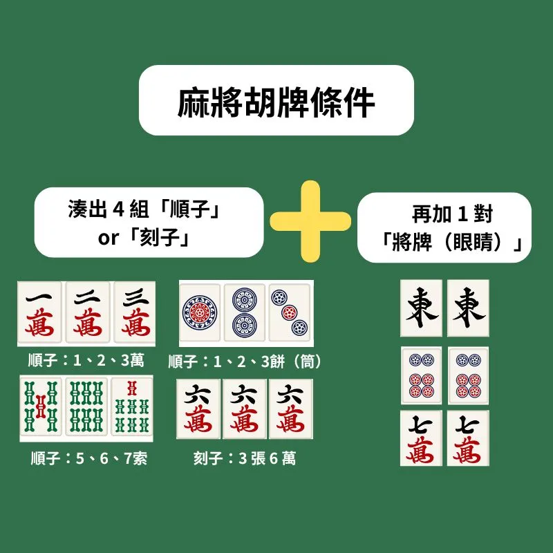

Below is a Markdown-formatted version of the main content from the article "麻將規則有哪些？一篇教會新手從抓牌到算台！" on Pinkoi blog, including images as presented in the article. Only the article's content is included, without unrelated material.

# 麻將規則有哪些？一篇教會新手從抓牌到算台！

更新日期： 2025 年 7 月 23 日

麻將規則有哪些？打麻將怎麼開始？這篇新手懶人包整理了最常見的台灣麻將玩法與基本規則。

**從牌型花色介紹、抓牌順序、出牌流程，到怎麼吃、碰、槓、聽、胡，以及怎麼算台**，Pinkoi 一次說明！

無論你是第一次學麻將，還是只會胡卻搞不懂台數，這篇都能幫你快速上手，輕鬆打出第一圈！

## 麻將花色與牌面怎麼看？圖解介紹各類牌型

一副麻將共有 144 張牌，其中包含以下幾種不同的牌：

### 1. 1～9 萬
也被稱作「萬子」，每張萬子有 4 張、共 36 張牌。

### 2. 1～9 索
也被稱作「索子」或「條子」，每張索子有 4 張、共 36 張牌。

### 3. 1～9 餅
也被稱作「筒子」，每張筒子有 4 張、共 36 張牌。

### 4. 風牌
共有「東」、「南」、「西」、「北」4 種風牌，每種 4 張共 16 張牌。

### 5. 三元牌
共有「中」、「發」、「白板」3 種三元牌，每種 4 張共 12 張牌。

### 6. 花牌
包含四季牌「春」、「夏」、「秋」、「冬」及四君子牌「梅」、「蘭」、「竹」、「菊」，每種牌各 1 張共 8 張牌。

## 新手必學！6 個打麻將前一定要懂的規則

### 1. 麻將抓位怎麼決定？教你抓位一次搞懂！

**打麻將前第一步就是「抓位」，也就是決定誰坐在哪個方位。**

開始前，先從所有麻將牌中找出「東、南、西、北」這 4 張風牌，蓋住後隨機洗混。

4 位玩家先隨意入座，再由其中一人擲出 3 顆骰子，從自己開始逆時針數點數。

數到的人就先翻一張風牌，拿到哪一張，就坐到那個位置，例如：抽到「南風」，就坐在南的位置（從擲骰者開始逆時針數：東 → 南 → 西 → 北）。依此類推，直到每個人都拿到風牌並入座完畢，就完成抓位！

📌 情境舉例：

四位玩家依序就座為：

小明、小花、小玉、小葉，採逆時針方向排列。

小明擲骰子，點數總和為 9 點。

接著從小明本人開始，逆時針數到第 9 位玩家，依序如下：

1 → 小明  
2 → 小花  
3 → 小玉  
4 → 小葉  
5 → 小明  
6 → 小花  
7 → 小玉  
8 → 小葉  
9 → 小明 ✅

所以這次由小明先抽風牌，假設他抽到「西風」，就移動到西的位置入座。

其餘三位玩家也依序抽取剩下的風牌，並根據各自抽到的風牌對應座位方向（東南西北）入座。

### 2. 麻將如何洗牌、堆牌？

四位玩家就定位後，就可以開始準備牌局。首先，

**將所有麻將牌面朝下攤在桌面上，大家一起動手把牌打散，這個步驟就叫做「洗牌」。**

洗完後，每位玩家從牌堆中各自拿出 36 張牌，在自己面前**橫向排成兩層，每層 18 張**，堆成一道「18×2 的牌牆」。

四面牌牆圍成一個方形，就是麻將開局前的基本擺法。

### 3. 誰是莊家？骰莊規則與流程快速看懂

在麻將中，每局都會有一位「莊家」，也就是

**這局最先出牌的玩家。**

莊家贏了可以「連莊」，繼續當莊家，還能贏到更多台數；但如果當莊家卻輸了，反而要賠比較多。

當莊有好處，也有風險！

那要怎麼決定第一局的莊家呢？這時就要進行「骰莊」。

**骰莊只會在遊戲一開始進行一次**，等大家堆好牌後，由抽到「東風」的玩家擲骰子。

從擲骰的人開始，**逆時針數骰子總點數**，數到的那位玩家就是這局的第一位莊家。接下來遊戲就會從他開始進行！

🎲 情境舉例：誰是第一位莊家？

假設四位玩家的座位順序（逆時針）為：小明 → 小花 → 小玉 → 小葉。

這時，由抽到「東風」的小花擲骰子，結果擲出點數總和為 7 點。

接著從小花開始，逆時針數 7 位：

1 → 小花  
2 → 小明  
3 → 小葉  
4 → 小玉  
5 → 小花  
6 → 小明  
7 → 小葉 ✅

所以這局的第一位莊家是：小葉。

因此，小葉就會從自己那一端拿牌，並出第一張牌，這一局就正式開始啦！

### 4. 麻將怎麼取牌？從抓牌到理牌的基本流程

開局由當局的莊家擲骰子，決定從哪裡開始拿牌。

擲完骰後，從莊家自己開始，**逆時針數骰子的總點數**，數到的那一面牌牆就是 **這局的開牌位置**。

每一面牌牆共有 18 堆疊好的牌（兩張疊在一起算一堆）。從擲骰點數的下一堆開始拿牌，舉例來說，**如果骰子點數總和是 14，就從第 15 堆牌開始拿。**

接下來由莊家開始，**每位玩家依逆時針方向輪流拿牌**，每次拿 2 堆（共 4 張），輪流拿 4 次，總共會拿到 16 張牌。

🎲 取牌情境範例：

假設本局的莊家是小明，他擲出了骰子，點數總和為 14 點。

👉 從小明開始，逆時針數到第 14 堆牌牆：

順序為：小明（1）→ 小花（2）→ 小玉（3）→ 小葉（4）→ 小明（5）→ ……→ 第 14 堆在小花的面前。

👉 從第 15 堆開始取牌：

也就是小明從小花面前的牌牆上，第 15 堆的兩張牌開始作為起牌點，取這兩堆牌。

👉 接下來逆時針輪流取牌：

小明拿完後，就換小花、小玉、小葉，每次取兩堆（4 張牌），逆時針輪流拿 4 次。

### 5. 開門是什麼？補花怎麼做？特殊規則別搞錯！

當每位玩家都拿滿 16 張手牌後，

**莊家會再多拿一張牌**，這個動作叫做「開門」，也就是這局麻將的 **第一張正式出牌**。

而「補花」則與特殊牌有關，

**若玩家手中有「花牌」（像是梅、蘭、竹、菊，或春、夏、秋、冬）**，就可以 **先將花牌亮出來，放在自己牌前面**，接著進行補花動作。

**補花方式**：從牌尾補進相同張數的新牌。如果補進的又是花牌，那就再補一次，直到補到不是花牌為止。

## 麻將怎麼打？先學會吃、碰、槓、聽！

### 麻將的玩法流程是什麼？

完成「開門」後，整個牌局就正式開始了！由

**莊家先摸第一張牌**，接著打出一張不要的牌，然後換下一位玩家依照 **逆時針方向**依序進行：先摸牌、再出牌。

這樣的流程會持續進行，直到有其中一位玩家湊齊完整牌型並

**成功「胡牌」**，整個牌局就會立即結束。

但如果牌全部摸完也沒有人胡牌，這種情況就叫做「**流局**」。

流局時，

**莊家不變**，由原本的莊家繼續擔任莊家，重新開始新的一局。

### 吃牌

當你的上家（左手邊的玩家）打出了一張牌，剛好可以和你手中的兩張牌湊成「順子」，你就可以「吃牌」。

✅ 順子的意思：同一花色、連號的三張牌

例如：你有「四萬」和「五萬」，上家打出「六萬」時就可以吃。

吃牌後，這三張牌要攤開放在自己面前，接著從手牌中選一張不要的打出來，完成這一回合。

### 碰牌

無論是哪一位玩家打出的牌，只要你手上有另外兩張一樣的牌，就可以「碰牌」，組成「刻子」。

✅ 刻子的意思：三張一模一樣的牌

例如：你有兩張「發財」，有人打出一張「發財」，你就可以碰。

碰牌後，三張牌要攤開在自己面前，並從手牌中再打出一張。

### 槓牌

當你手上有三張一樣的牌，若有玩家打出同樣那一張，你就可以「槓」！

與「碰牌」一樣，這四張牌會公開放在面前，不同的是，

**你可以多摸一張補花牌**（等於抽一張額外的牌），然後繼續打出一張牌。

### 聽牌是什麼？

當你手中的牌已經只差一張就能胡牌，這時就叫做「聽牌」。

例如：你已經湊好四組牌 + 一對將，只差一張「三索」，那你就是「等三索胡牌」，正在聽牌中！

## 麻將怎麼胡牌？新手必學胡牌條件

### 胡牌標準組合

4 組牌型（順子或刻子）+ 1 組將牌（又稱「眼睛」），總共要湊出 14 張牌，牌型如下：

- 順子：三張同花色、連號的牌，例：一、二、三索 ｜ 五、六、七萬。
- 刻子：三張一模一樣的牌，例：三張東風 ｜ 三張紅中 ｜ 三張九筒。
- 將牌（眼睛）：也叫「眼睛」，兩張一樣的牌即可，例：兩張發財、兩張八索。

### 胡牌的方式有哪些？自摸和放槍

- **自摸**：你自己摸到最後那張湊成牌型的牌。
- **放槍**：別人打出剛好能讓你胡牌的那張牌（由他承擔輸分）。

若牌摸完也沒人胡，那就「流局」，這局沒人得分，莊家繼續當莊家重來一局。

## 麻將怎麼算台數？常見牌型與加台組合一次搞懂！

當牌局有玩家胡牌後，不是每一次的胡牌都一樣分數。這時就要根據

**胡牌的牌型與方式**來計算「台數」，決定誰輸誰贏、輸贏多少。

### 什麼是「台數」？

簡單來說，

**台數就是胡牌的分數單位**，越難湊成的牌型、越稀有的組合，就能得到越多台數，代表能贏得更多籌碼。

### 常見胡牌方式與台數加成表

| 胡牌名稱 | 胡牌條件                                | 台數加成 |
|---------|-------------------------------------|---------|
| 自摸     | 自己摸到胡牌的那張牌                      | +1 台   |
| 門清     | 沒有吃、碰或槓，全程靠自己摸進牌組成牌型        | +1 台   |
| 平胡     | 沒有吃碰槓、都是順子，且將牌不能是中發白或風牌（胡的那張牌不能與將牌重複） | +1 台   |
| 大三元   | 紅中、青發、白板各三張（共三組刻子）            | +8 台   |
| 小三元   | 紅中、青發、白板其中任兩組刻子 + 其中一張作將牌     | +4 台   |
| 大四喜   | 東、南、西、北各三張（共四組刻子），極難湊成       | +8 台   |
| 碰碰胡   | 全部都是刻子（或槓子）與一對將牌，不含順子         | +4 台   |
| 四暗刻   | 四組都是暗刻（未吃碰槓、完全自摸），再加一對將牌     | +6 台   |
| 混一色   | 所有牌為同一種花色（萬、筒、索其一）+ 字牌          | +3 台   |
| 清一色   | 所有牌為同一種花色（不含任何字牌）                 | +6 台   |
| 海底撈月 | 在最後一張牌時自摸胡牌                            | +1 台   |
| 天地胡   | 莊家第一輪就胡牌（天胡），或閒家第一輪胡牌（地胡），極罕見情況 | +8 台   |

If you require the markdown file as a downloadable or want the content in a different format, please let me know.

- [1] https://blog.pinkoi.com/tw/hot-topics/discovery/2211-mahjong/
- [2] https://en.pinkoi.com/product/LV2E7kKv
- [3] https://en.pinkoi.com/product/qKNPrUd8
- [4] https://en.pinkoi.com/product/q5AGd9Kx
- [5] https://en.pinkoi.com/product/UfZyXF2d
- [6] https://en.pinkoi.com/store/machill
- [7] https://en.pinkoi.com