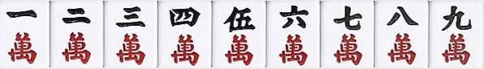
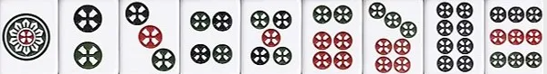
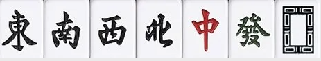
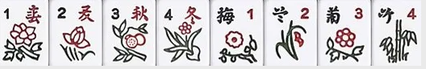
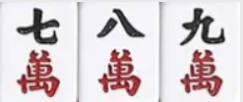
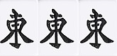
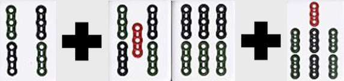
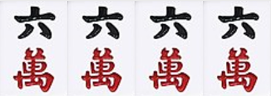

# 【麻將玩法】新手快速認識麻將！台灣16張麻將教學

麻將，可以算是台灣人最常在佳節或是休閒時最常接觸的台桌遊戲。

但是麻將在亞洲各地有著不同且不一樣的玩法，今天要講的就是目前流行於台灣且到現在還是非常多人玩的台灣16張麻將遊戲

麻將的起源就不做過多的介紹，這篇文章主要是要來快速帶大家認識台灣16張麻將的玩法、規則甚至教給大家實用技巧！

## 麻將

麻將 又稱「麻雀」，麻將共有144張牌，在台灣，麻將胡牌時必須台桌上湊滿5副順子(123)或三張一樣的(111)，以及一對(11)，胡牌總共加起來17張。

麻將如果要開始必須得要四人湊一桌，八人加開一桌，以此類推。

但在後續的遊戲中，礙於四人真的非常難以湊齊，而後衍生出三人麻將、兩人麻將等玩法。

### 麻將牌組

- **萬子** : 一萬至九萬，每一張萬子各有四張牌(一萬*4 以此類推)  
  
- **條子** : 一條至九條，每一張條子各有四張牌(一條*4 以此類推)  
  
- **筒子牌** : 一筒至九筒，每一張筒子各有四張牌(一筒*4 以此類推)  
  
- **字牌** : 東、南、西、北、中、發、白 以上字牌共七種，每一張牌各有四張(東*4 以此類推)  
  
- **花牌** : 台灣16張麻將專用 (花牌在日本、香港等特定地區是看不到的，僅有在台灣才有花牌一物)  
  
  
### 遊戲開始

#### 座位決定

打麻將的座位可不是隨便坐的，打牌一開始會先進行「抓位」，也就是說決定每一位玩家的座位。首先四個人可以先隨便坐，然後從麻將裡先拿出「東、南、西、北」各一張，蓋起來洗牌後，隨機由其中一位玩家擲3顆骰子，根據擲到的點數決定要由誰率先抽牌。

- 若擲到5、9、13、17點，是由丟骰者自己從剛蓋牌的「東、南、西、北」抽一張牌。  
- 若擲到6、10、14、18點，是由丟骰者下家（即右手邊的玩家）開始抽牌。  
- 若擲到3、7、11、15點，是由丟骰者對家開始抽牌。  
- 若擲到4、8、12、16點，是由丟骰者上家（即左手邊玩家）開始抽牌。  

以丟骰者的人為東風位，逆時針方向東-南-西-北，依照抽到牌的風位入座。

#### 麻將洗牌堆牌方式

大家都入座之後，就會將全部144張牌面朝下蓋住洗牌，緊接著進行「堆牌」，四個人分別在自己面前將牌疊成 2×18的牌牆，如果有牌尺的話，橫面長度會跟牌尺一樣長。各疊完牌牆後將其組合一個四方形，所以麻將又稱為「方城之戰」。

#### 麻將開牌與拿牌

砌好牌牆之後就可以開始打牌，首先由剛剛抽牌的東風位當莊家擲3顆骰子，決定由哪一面牌牆開始拿牌，記得準則就是風位、拿牌、取牌都是以擲骰子者為1，逆時針計算，即：

- 擲到5、9、13、17點，由莊家自己面前開始取牌。  
- 擲到6、10、14、18點，由莊家下家（即右邊的玩家）面前開始取牌。  
- 擲到3、7、11、15點，由莊家對家面前開始取牌。  
- 擲到4、8、12、16點，由莊家上家（即左邊的玩家）面前開始取牌。

決定哪一面牌牆開始取牌後，從牌牆右邊開始計算，例如若擲到5點，則從莊家面前的牌牆從右邊開始數5疊後，取第6、7疊牌（即取四張牌）後，再逆時針輪流取牌，即莊家下家取牌，每人每次取兩疊（四張）牌，直到每一位玩家都有拿到16張牌為止，最後莊家多拿一張牌，稱為「開門」。

#### 麻將補花規則

當莊家拿完「開門牌」後，玩家要先檢查自己手上有沒有花牌（梅、蘭、竹、菊 與春、夏、秋、冬 牌），如果先把花牌拿出來放在自己前面，由莊家開始進行「補花」，因為每個人手上要16張牌，如果把花牌拿出來就要再拿相對應數量的牌補到16張，因此稱之為「補花」。「補花」要從剛剛最一開始取牌的地方右手邊逆時針開始拿相對應的牌。如果沒有拿到花牌則不需要補花，請喊「過補」或「請補」，以提示下家進行補牌（補花的順序跟剛剛取牌的順序相同）。如果捕的牌仍然拿到花牌，須等到四家都補完後才可再補。

▲ 編輯提醒：麻將在進行時後，玩家的輪流順序是「逆時針」，但拿牌與補花的順序是「順時針」，這是很多新手玩家會搞錯的，特別提醒大家！

## 麻將規則

一般都是以莊家為主逆時針開始算分別為東風、南風、西風、北風，以此類推莊家右手邊為南風，左邊則為北風。

牌局開始，莊家可拿17張牌，其餘家各拿16張，並由莊家開始，通稱為起打。

若是莊家胡牌，下一把就可以連續當莊家，俗稱連莊；若是其他玩家胡牌，下一局則是輪流當莊，由該局莊家的下家輪流做莊家。

- **局**：出一次胡牌或是流局，稱局、一局。  
- **圈**：四人均當過一次莊家，稱圈、一圈。  
- **雀**：連續進行四圈稱雀也可稱將、一雀及一將。

台灣習慣通常一玩都是以一將為一場遊戲的時間單位。就一般遊玩速度，一將大致為1個鐘頭左右。兩將就是我們常講的摸八圈，基本上兩將要花將近三小時來進行。

### 順子
由3張連續數字的牌所組成。  

### 刻子
由3張相同的牌所組成。  

### 一對
由兩張相同的牌所組成，因為成雙對的關係，大部分都會講眼  

### 碰牌
持有兩張一樣的牌，當別人打出的牌加上總共三張皆可喊碰。

### 吃牌
當手上有五條及六條，僅需要有四條或七條打出都可以吃  

 
### 槓牌
槓牌最簡單，四張唯一槓  

